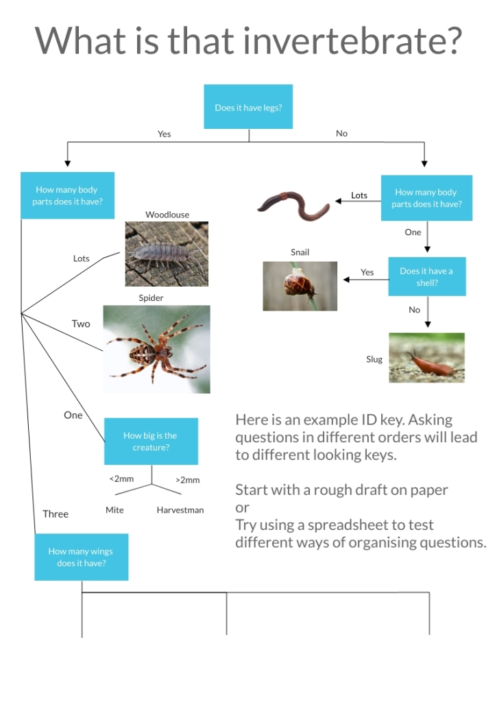

https://knowingnature.podbean.com/mf/play/pbii89/Ep_10_-_Invertebrates_from_home.mp3

More ideas for engaging with nature while we’re all stuck indoors. This
episode we look at how to get started studying invertebrate from the comfort
of your own home.

What is a minibeast?

Used in the UK to refer to invertebrates. Invertebrates are the group animals
which do not have a spinal column or notochord, which is a rod-like structure
running down the length of the body. When working with kids this is usually
simplified to having an internal skeleton.

The term ‘minibeasts’ can be confusing to some children because animals like
frogs or mice are ‘mini’ and ‘beasts’,  but are not minibeasts as most people
use the term in the UK. Explaining why frog and mice are not minibeasts is the
same as explaining what defines an invertebrate. So if you are teaching a term
anyways, you may as well start with ‘invertebrates’ because it has a clear
scientific definition.

Importance of the scientific terms

  * Using scientific terminology get you thinking in terms of details and shared features
  * Scientific terms have agreed specific meaning. (Other people will know exactly what group of features you are referring to)
  * Can be important starting point in understanding an animal’s biology
  * Helps you make links between animals with shared features.

How to learn more about invertebrates

Read up on ones you are curious about. Or research what conditions are
suitable for invertebrates you want to attract

  * Can you create a small habitat to attract desired invertebrates? 
  * What plants can you put in a window box to attract specific butterflies?

**Find one and observe it.**

  * Try looking for invertebrates in these places:
    * Windowsills
    * Corners
    * Under the sink
    * Under outdoor doormats
    * Flowerpots and in compost

If you find a dead invertebrate try pinning or carding them to protect you
specimen as you examine it.

Pinning \- Stick a pin through the thorax (segment just behind the head),
leaving enough room between the specimen and the head of the pin for you to be
able to pick up the pin without touching the specimen.

Carding \- Use white glue to attach the specimen to a small paper/card
rectangle. Small specimens can be ‘pointed’, glued to the tip of a long
triangle. Put a pin through the card on the side opposite the specimen, again
leaving enough room for you to pick up the pin without touching the specimen.

**Look for invertebrates in the park**

Go out in early morning or evening while most people are indoors. This will
make it easier to maintain recommended 2m minimum distance from others.

  * In the morning many invertebrates will sit in sun to warm up for the day. Look for:
    * Wolf spiders on broad leaves in tall grass or near hedges
    * Flies, bees, on fence posts 
    * Butterflies on shrubs
  * In early evening, nocturnal creatures will start to become active. Look for:
    * Slugs and snails on soft leaved plants
    * Worms and woodlice in leaf litter or grass

**Foster a critter**

  * Build a habitat for a critter you find
  * Research what conditions they need
  * Use a coffee filter or mesh to allow some air exchange. Or take the lid off once a day and blow gently into the jar. 
  * Observe their behaviour for a few days
  * Return them to where you found them

Good foster invertebrates are:

  * Slugs and snails  \- Watch how they feed and watch how them move as the move along the glass.

  * Worms **** \- Use a smaller container in the centre of the jar and wrap thick or dark paper around the outside to block out light when you are not observing your worm and ensure the worms spend their time close to the glass.)

**Create your own ID key**

  * Write detailed descriptions and/or take photos
  * What features do you think are important in identifying
    * What is the most useful way to arrange your guide?
    * Alphabetical?
    * A key asks a series of questions about what you are trying to identify.
      * Does the order of the questions matter?
      * Legs, body parts, wings
      * Wings, body parts, legs
      * Play around with slips of paper
      * Fill out a table in a spreadsheet and sort the columns to create your own guide.

You an use spreadsheets to help quickly draft the order in which you ask questions about an invertebrate in order to reach an identification. [Here is an example set of spreadsheet data.](https://docs.google.com/spreadsheets/d/1F1Glwm4o_zS73jYPNFD166CvQ7X9TVPx-v-EFw6gdIc/edit?usp=sharing)

Below are some example keys made using free online flowchart making sites. We
found Lucidchart to be the more user friendly of the two.

Made using: [https://](https://www.lucidchart.com/)[www.lucidchart.com](https://www.lucidchart.com/)[/](https://www.lucidchart.com/)

  * 
  * 

  
Thi

Made with [https://](https://www.visme.co/)[www.visme.co](https://www.visme.co/)[/](https://www.visme.co/)

**This is what scientists do to classify living things**

  * Every species should have its own set of unique characteristics
  * Not all characteristics are important for identification
    * Colour, size
  * Sometimes the key characteristics aren’t easily visible
    * Very small, internal, genetic differences

Send us questions or comments at [knowingnaturepodcast@gmail.com](mailto:knowingnaturepodcast@gmail.com)

Intro/Outro music: Selfish by [Derek Clegg](http://freemusicarchive.org/music/Derek_Clegg/)

licensed under a [Attribution-Noncommercial-Share Alike 3.0 United States License](http://creativecommons.org/licenses/by-nc-sa/3.0/us/)

