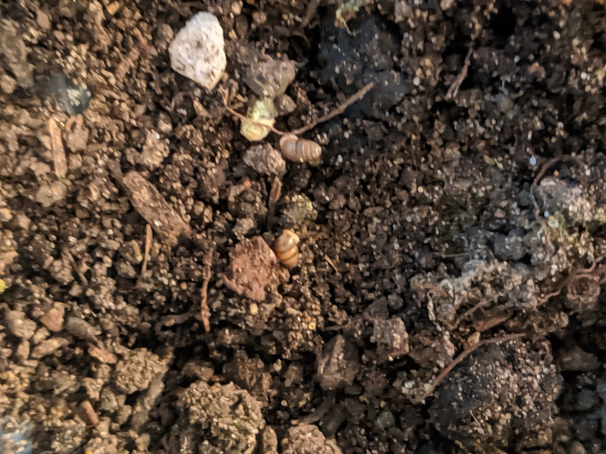
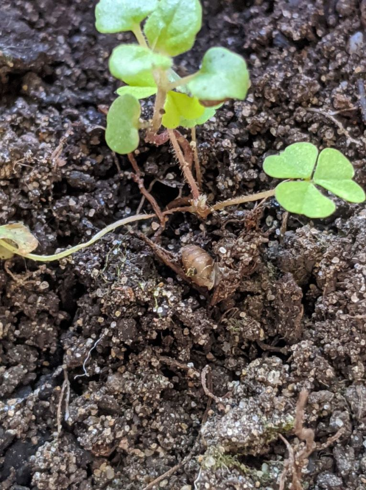
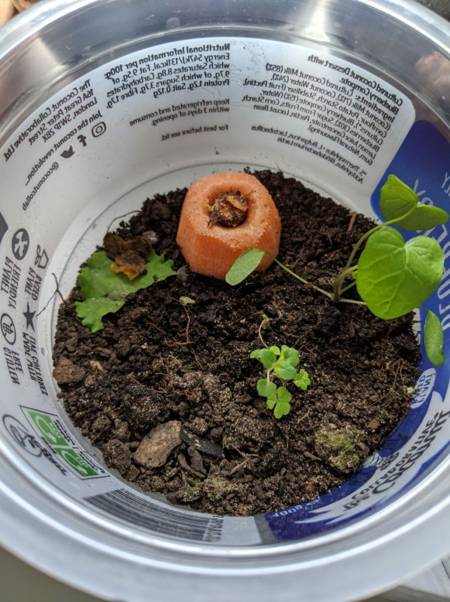
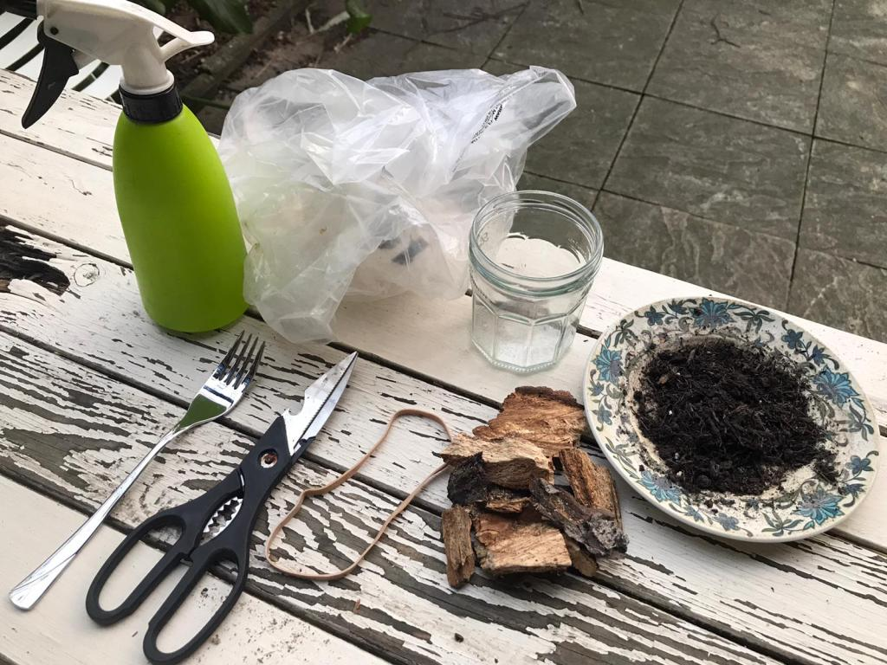
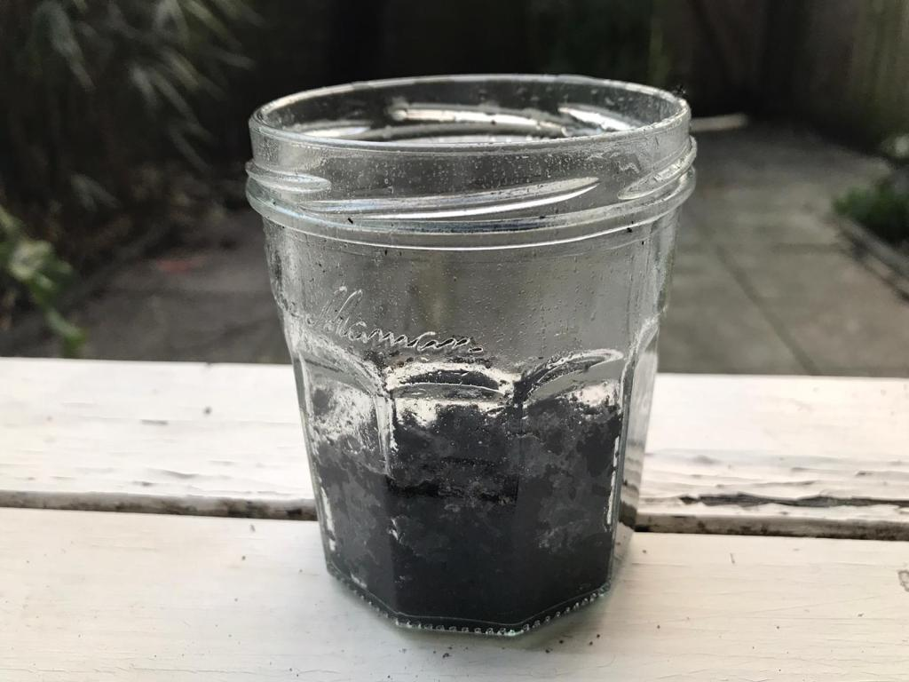
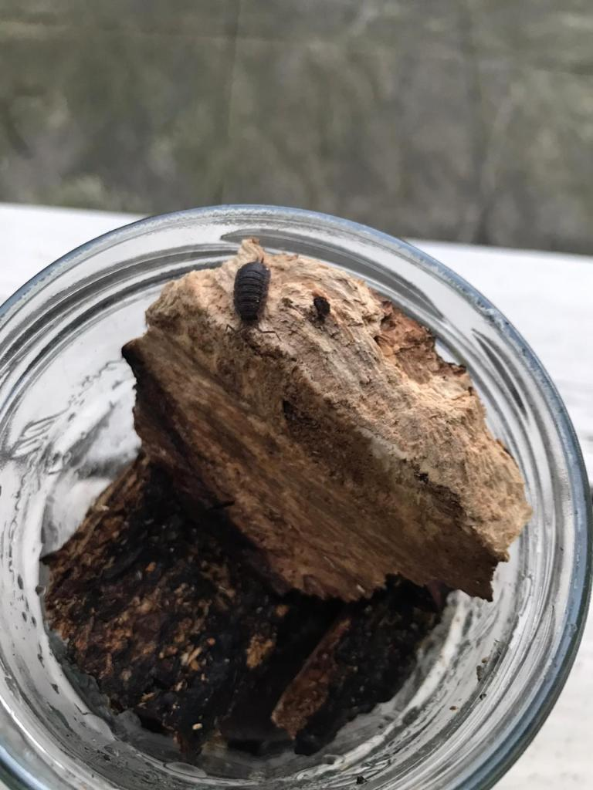
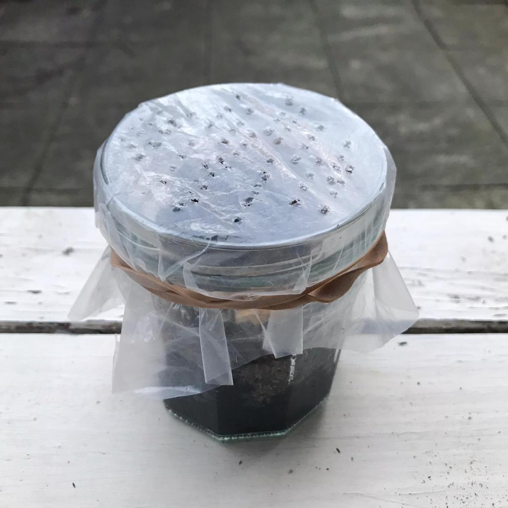
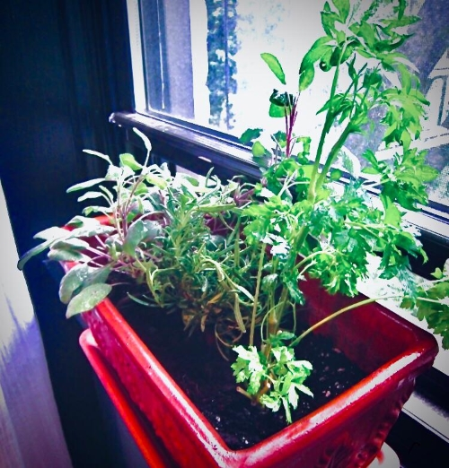



A short add-on to our last episode. I asked some friends to share the homes
they're created for invertebrates, and tell us about how they put the habitats
together.

## Victor's home for tiny snails

Made with a yogurt container with some soil from another flower pot. I also
decorated their home with weed seedings carefully dug out from other flower
pots. And a carrot top and wilted salad leaf in case they get hungry and don’t
fancy fresh leaves. This home is located on a north facing windowsill so it
doesn’t overheat when the sun comes out.

So far I’ve spotted them moving around on the soil, but not approaching the
carrot or the wilted salad leaf. According to this handy snail ID sheet from
the bedfordshire natural history society it’s a type of chrysalis snail.

The picture ID guide I used can be found at: [www.bnhs.co.uk/youngnats/to-do/identify-snails-and-slugs](https://www.bnhs.co.uk/youngnats/to-do/identify-snails-and-slugs/)

For more in depth snail identification visit the The Conchological Society of
Great Britain and Ireland at: www.conchsoc.org/

And the Field Studies Council has published an excellent key to the Land Snails of the British Isles which can be found here: [www.field-studies-council.org/shop/publications/land-snails-in-the-british-isles-2nd-edition/](https://www.field-studies-council.org/shop/publications/land-snails-in-the-british-isles-2nd-edition/)

  
  
  

## Maggie’s home for woodlice

Made with a jam jar and soil from the garden. Decorated with rotting wood from
a cut down tree along the road and misted for moisture. The lid is made with a
plastic bag poked with small holes for air circulation. The woodlouse habitat
lives on a shady windowsill.

Woodlice are crustaceans and so need to live in quite damp areas in order to
breathe. They eat rotting wood, so the wood is both a hiding place and a
snack. Woodlice can also be fed on vegetable peels but avoid anything sour,
like citrus.

Again the Field Studies Council have produced really good guides to the
identification of woodlice. There is the woodlouse identification guide, for
more detailed work. Or the Woodland Name Trail for an introduction to soil
invertebrates. Find them at: <https://www.field-studies-council.org/>

  
  
  
  

## Ayesha's windowbox for butterflies
Made with a small window box planted with kitchen herbs. Herbs were bought
from a local grocer, rescued from being tossed for being out of date. Just
repot them in a bigger container to give them room to grow and water
regularly.

Almost all kitchen herbs are great for attracting bees and butterflies. Allow
them to grow and most will flower late spring/summer. Cutting them to use in
cooking may push their flowering time back.

If you get unwanted invertebrates, try a spray made from: water, a few drops
of soap, and a mashed garlic clove. The soap helps penetrate the waxy coating
some invertebrates have protecting them, and garlic contains sulfur compounds
which act as natural insecticides.

  

Send us questions, comments, or photos of your invertebrate habitats!
