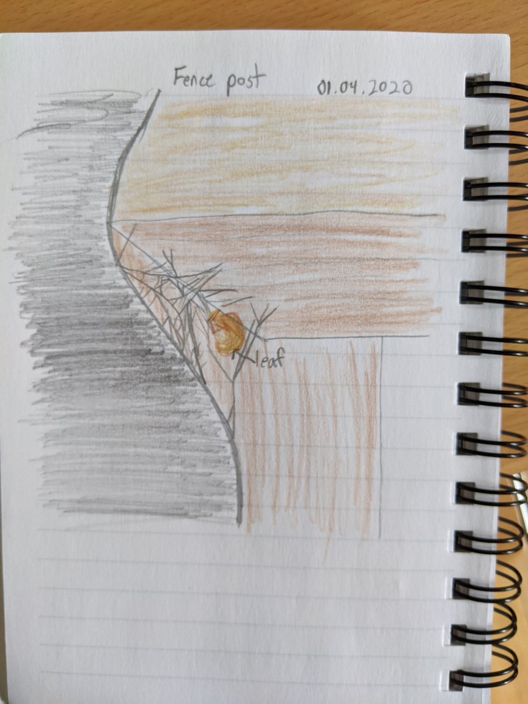

This episode we continue the invertebrate theme but focusing on spiders.

Spiders are invertebrates belonging to the class of _Arachnida_ , which are
characterised by having 8 legs. Some arachnids will have other modified body
parts which look like arms/legs, such as scorpions which have mouthparts
modified to become pincers. Spiders are a group within the arachnids, all
belonging to the order Aranea. They have two body segments, the cephalothorax
and abdomen, and produce silk from spinnerets located at the tip of the
abdomen.

## Common UK spiders in houses

### Cellar spiders

  * What do they look like? Very long legs, small grey/brown/translucent bodies. 6-9mm bodies but legs can be 5x longer. 
  * Where do they live? In corners. Near ceilings.
  * What kind of webs do they spin? Messy, tangled, ‘cobwebs’
  * What do they eat? Other spiders, flies, insects
  * Are they harmful? No

### House spiders

  * What do they look like? Can grow to be very large. Leg span up to 120mm
  * Where do they live? Near ground level in corners.
  * What kind of webs do they spin? Funnel webs. Flat sheets of silk with a silk tube at the narrow end.
  * What do they eat? Insects.
  * Are they harmful? May bite, but not dangerous.

### False widow spiders

  * What do they look like? 9 - 14mm. Dark, glossy body with round abdomen. Many species have lighter spots and markings.
  * Where do they live? Corners near ground level, in cupboards, ceiling corners.
  * What kind of webs do they spin? Funnel webs. Messy sheets of silk with a tube at the narrow end.
  * What do they eat? Insects
  * Are they harmful? Can deliver a painful bite, but very rarely serious.

## Spider bites

**Black widow  spiders**

Found in North and Central America. Can deliver a very painful but death is
very rare. A review of data from the US National Poison centre, showed that
from 2000 to 2008 there were 23 000 instances of black widow bites, and no
deaths. Most cases do not require treatment. For severe reactions effective
antivenom treatments exist.

Monte, Andrew & Bucher Bartelson, Becki & Heard, Kennon. (2011). A US
Perspective of Symptomatic Latrodectus spp. Envenomation and Treatment: A
National Poison Data System Review. The Annals of pharmacotherapy. 45. 1491-8.
10.1345/aph.1Q424.

**Brazilian wandering spider**

Infamous for occasionally being found in bunches of bananas. Like black
widows, their bite is painful but rarely serious or life threatening. Their
venom is very toxic, but they usually inject very small quantities. An
epidemiological study of 400+ cases in Brazil found that bite sufferers were
more likely to show no symptoms than to die from a bite.

Bucaretchi, Fábio, Deus Reinaldo, Cláudia Regina de, Hyslop, Stephen,
Madureira, Paulo Roberto, De Capitani, Eduardo Mello, & Vieira, Ronan José.
(2000). A clinico-epidemiological study of bites by spiders of the genus
Phoneutria. _Revista do Instituto de Medicina Tropical de São Paulo_ , _42_
(1), 17-21.

### If you get bitten by a spider

Particularly strong bites may feel like a bee sting, and will fade in a few
hours.

  * Take a photo or capture the spider if possible.
  * If this is not possible then note down the size, colour, and any patterns.
  * Keep the bite clean.
  * An antihistamine may help.
  * Seek medical help if the pain gets worse, you feel tightness in your chest, or muscle cramps.
  * If you are worried seek medical advice or contact your local poison control centre.

[NHM advice on spider bites] (https://www.nhs.uk/conditions/insect-bites-and-stings/symptoms/)

## Activity ideas

**Spider cakes**
Use chocolate and plain icing in two separate piping bags to decorate cupcake
to mimic patterns on real spiders. Chocolate candy sticks can be used for
legs, and chocolate pieces for eyes!

**Spun sugar webs**

In a pot, heat sugar and a small amount of water of medium heat until the
sugar has melted completely. Immediately turn off the heat to keep the sugar
from burning. Dust a baking sheet with cornstarch. Scoop up some melted sugar
with a spoon and allow it to slowly drizzle onto the baking sheet in very fine
threads. The sugar will quickly cool and re-harden. Be careful as melted sugar
is extremely hot! When finished, soak your pot in water to dissolve away the
sugar.

**Cornstarch clay sculpting**
  * 1 part baking soda
  * 0.5 part corn starch
  * 0.75 part water

Combine in a pot. Heat gently. Stirring until the mixture thickens and becomes
a dough. Remove from heat and allow to cool. Knead the dough until smooth.
Create your sculpture and allow it to dry completely before painting.

**Watch a spider make a web**

Orb weaver spiders may re-weave their web each day. Watch the steps they go
through to make their web. The entire process can be as quick as 30 minutes. A
spray bottle which produces a very fine mist can help make the web visible.

**Sketch a web**

Here you just just need to capture  an impression of the shape. Don’t worry
about trying to capture every single thread. Looks for details like slightly
thicker threads. Where do they attach? These will be very strong, usually non-
sticky threads that form the framework of the web.

Look for other details like a silk tube where the spider might be hiding. How
does the web attach to surrounding plants? Often spiders will connect some
leaves together to form a hiding space to retreat to if something big attacks
their web.

  
  
  

**Use spiders to help you survey other invertebrates in your home** \
Spot their rubbish underneath the web. Can you figure out what they caught? If
you are very careful, you may be able to use pins or toothpicks to unwrap the
remains of the spider’s meal to get a better look.

**Make a spider hotel** \
Tied together sticks or bits of bamboo. The narrow holes are excellent hiding
places for funnel web and wolf spiders. Place your spider hotel in a sheltered
area where you’ll still be able to get a good view.

**Make a spider frame** \
Tie together 4 sticks to make a frame, around 20cm x 20cm. Attach a small
container to one of the upper corners facing into the frame. The frame will
provide good attachment points for orb weaver spiders, while the container
acts as a ready-made panic room for the spider to run to when needed. Place
your frame somewhere outdoors where you’ll be able to get a good view of it.

## Links to more information
  * Wildlife trust: [https://www.wildlifetrusts.org](https://www.wildlifetrusts.org/)[/](https://www.wildlifetrusts.org/)
  * Woodland trust: <https://www.woodlandtrust.org.uk/>
  * British arachnological society: <http://britishspiders.org.uk/>
  * American arachnological society: <http://www.americanarachnology.org/>

Send us your questions, comments, or photos of your spider cakes and web sketches!
You can find more on the [About Us](/about) page.

