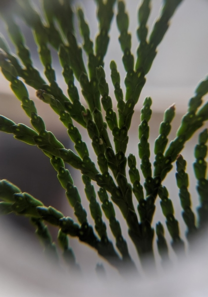
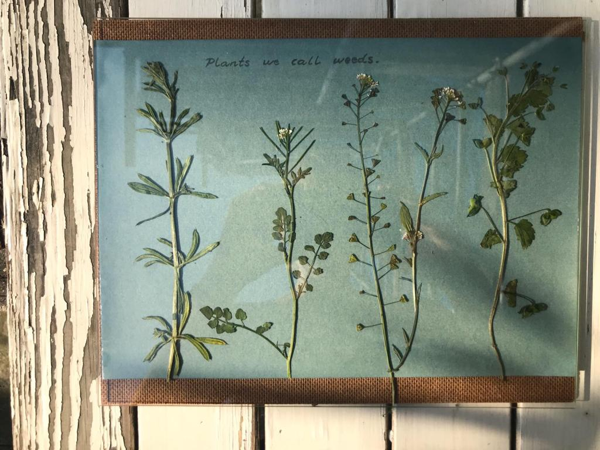



This episode we are joined by environmental educators Maggie and Paul to talk
about photography. We share tips and experiences using cameras and Paul and
Maggie tell us about their off the beaten track photography hobbies:
astrophotography and cyanotyping.

## Photography kit tips

Bridge cameras - In between a Digital Single Lens Reflex camera and a Point-
and-shoot. These cameras can offer excellent flexibility for those not wanting
to carry around too much weight.

Cell phone cameras - Can be great for macrophotography (close-up photos of
small things) and landscapes. Try putting a loupe magnifier directly in front
of the phone camera lens to really good magnification. Loup magnifiers are
small, magnifying glasses often used in the field. Usually with magnification
between x5 and x10.

  
  

## Taking photos for identification purposes

Try to get as many angles as possible. But certain groups of organisms have
specific characteristics which are particularly important.

* **Small plants/wildflowers** \- Flower from top-down, and side so you can see how
parts of the flower are arranged. Leaf shape and how they attach to the stem.

  
  
  

* **Mushrooms** \- Gills structure under the cap is often an important feature.
Bringing a small mirror can help you see this feature without needing to pick
the mushroom.

  
  
  

* **Insects and other invertebrates** \- Top-down, and side views. You are unlikely
to be able to identify many insect groups down to species level from a photo.
However photos of key characteristics can help narrow things down.

* **Flies and bees** \- Wing vein arrangement.

* **Blue damselflies** \- 2nd segment of the abdomen, just behind the wings.

* **Butterflies and moths** \- Underwing patterns can be as important as the upper
surface.

* **Snails** \- Facing the point of the spiral, facing the underside, shape of the
opening to the shell.

* **Birds** \- Underwing, tail patterns, silhouette of wing shape. Backlighting is
often a problem. Try to keep your back to the sun so the bird is lit from the
front. Otherwise Position yourself so the bird is in front of a tree or other
darker background.

## Astrophotography

Kit: Camera, Tripod, some way to release the shutter remotely.

Cost saving tips:

  * If you don’t have a tripod you can use a beanbag, jumper or other soft surface to prop your camera facing the sky.
  * Use your camera’s timer function so the camera takes the photo without you touching it.
  * Use multiple shorter exposures and stack them using software. 

  
  

## Cyanotyping

Kit: Cyanotype paper, or cyanotype chemical and paper or fabric.

Tips:

  * Press plants first so there is better contact with paper
  * Weight things down with a sheet of glass or clear plastic
  * You can get a sepia effect instead of the blue by using sugar soap of sodium carbonate solution to bleach the image, and then soaking in a strong tea solution.

  
  
  

## Photography with kids

  * Start with things that don’t move much
  * Bring a container. Focus on the bottom of the container will help you to get invertebrates in focus. 
  * Bring a piece of paper to put behind subjects to help cameras focus.
  * Don’t be afraid to make mistakes! The wonderful thing about digital photography is that it is very forgiving to experimentation.
  * Look carefully at your surroundings. 

[Share your photos](/about) with us, we'd love to see them!
