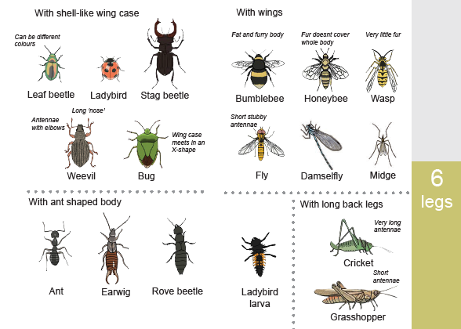
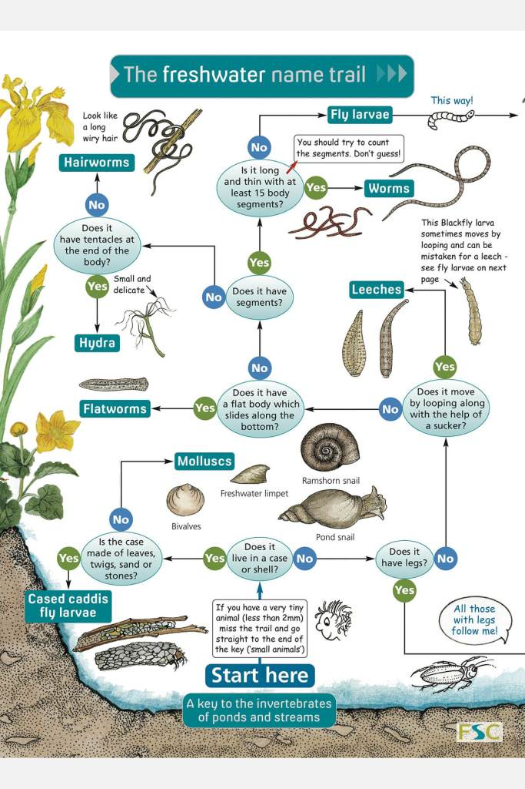
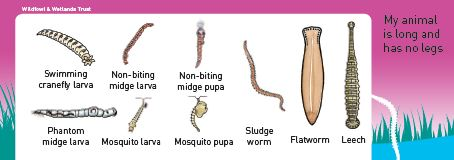
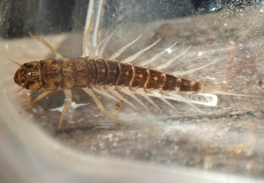
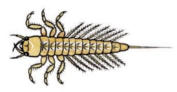
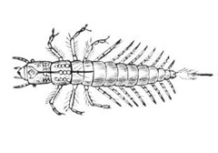



Interview with Paul, Learning manager at the London Wetland Centre (LWC). A
site maintained by the Wildfowl and Wetlands Trust (WWT). We discuss the ever
popular pond dipping sessions, how they're structured, and the resources
provided to support students. Paul also shares his thoughts on the wonders of
exploring nature at night.

Find out more about the London Wetland Centre:
<https://www.wwt.org.uk/wetland-centres/london>

More about the Wildfowl and Wetland Trust: <https://www.wwt.org.uk/>

## Pond dipping

### Public sessions

  * Drop-in sessions (45 minutes)
  * Aquarium nets, white trays, simple ID guides, plastic containers
  * Staff and volunteers on hand to help with tips, ID, other questions
  * Participant dwell time tends to be 10-15 minutes
  * Have trialled 30 minute booked sessions, this tends to lengthen individual dwell time to 20-25 minutes.

### School sessions

  * Begins by recalling what students already know about habitats
  * Head to pond for quick health and safety briefing, hand out equipment
  * Students select an animal to observe in more detail
  * Head back to work area with animal
  * Set task of investigating: How animal survives in the habitat, classification of the animal, adaptations
  * Part way through observation question or prompt sheets can be given out for support
  * Observations and ideas are recorded on small whiteboards
  * Groups share their observations as the class views the animal projection on a screen

## Supporting resources

London Wetland Centre uses bespoke resources to support most students. This
decision allowed the resources to reflect the most commonly encountered
creatures, removing creatures which would not be found on the site because of
habitat type or geographic range. Information can be tailored to support
objectives of particular sessions. Off-the-shelf resources are often too
general, with distracting or irrelevant details.

### ID Keys

**Branching key** \- [Freshwater name trail from the Field Studies Council](https://www.field-studies-council.org/shop/publications/freshwater-name-trail/) is designed for older groups. Proper use depends on details which can be difficult to observe and language which can be tricky for younger groups. Most groups use it as a gallery of images, scanning the chart for matching image rather than working through the key. This is used at the centre for groups age 11+

**Sorted gallery** \- The is the bespoke guide currently used at LWC. It was
developed based on observations of how children talked about and groups the
animals they were encountering. Pond creatures are grouped into a few
categories, each described by a simple sentence. The guide opens to a page
with a gallery of images which student match against.

**Simplified taxonomic** \- Used at the centre for terrestrial invertebrates.
The guide was developed based on the model of the sorted gallery, but the
sorting features supports teaching about classification. Students begin by
looking at the number of legs. This opens to a page with a gallery of images
and separates the invertebrates into insects, arachnids etc. Significant
characteristics for further classification are called out with simple
sentences.

Both the sorted gallery and simplified taxonomic key take advantage of the
tendency for children to scan the images to find a match. Placing similar
creatures together of a page limits the number of images (which speeds the
process), and encourages close observation of details in order for students to
arrive at a conclusion. When presented with a single page chart of all common
creatures, finding a match can be slow, and students can easily end up at an
incorrect conclusion because they have stopped looking at the first roughly
similar image.

  
  
  

**Image style**|  **Pros/Cons**  
---|---  
 |  **Photo** \- Backgrounds can be distracting/make some features harder to distinguish. \- High level of detail and colour can make it easier to match. \- Kids can pay too much attention to details specific to the pictured individual, making it harder identify if the animal is from a related species.  
 |  **Simple illustration** \- Gives sense of colour \- Should include key ID features \- Limited details means it is easier to interpret
 |  **Detailed line drawing** \- Too much detail can make it difficult to interpret by those with less experience \- Kids can pay too much attention to details specific to the pictured individual, making it harder identify if the animal is from a related species.  
  
### Supporting information

Provided to support students with less prior knowledge. Groups/adult helpers
can also be provided with question sheets to help groups maintain focus on the
task, and word banks to prompt students to use descriptive scientific
language. These are hit or miss, with some groups using them as
worksheets/answer sheets. The current solution is to give out these resources
after groups have had time to record their own ideas to support closer
observation. Some groups may not need this support at all.

**Information given**|  **Pros/Cons**  
---|---  
*Eats other animals   
*Breathes through gills on its sides   
*Can swim by wiggling  
  
  
|  _Focuses on needs of living things  
_ \+ Describes behaviour which is often not observable in session  
\- Gives away answers  
\- Observing and thinking can be replaced by copying the sheet
  
* Has big jaws   
* Has gills on its sides   
* Has big eyes    
  
|  _Focuses on body parts/adaptations  
_ \+ Draws attention to key features for the lesson  
\+ Still need to draw connection with adaptation  
\- Observing and thinking can be replaced by copying the sheet. This can be
mitigated by asking to include details like measurements or drawing an
illustration.  
  
* Pounces on other animals   
* Sits in burrow   
* Can swim by wiggling|  _Focus on behaviours  
_ \+ Describes behaviour which is often not observable in session  
\+ Still need to draw connection with adaptation  
\- Observing and thinking can be replaced by copying the sheet  
  
## Night Safaris

  * Welcome and team building games
  * Den building
  * Snack and stories until dusk
  * Bat and nocturnal nature walk
  * Astronomy (weather and time permitting)
  * Recap of the evening around the campfire with marshmallows

