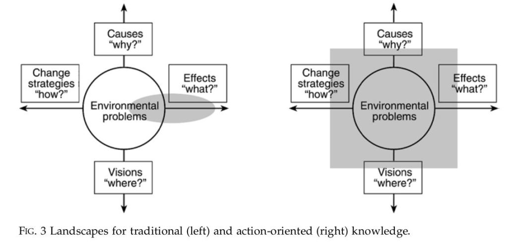



When gigantic spaceships touchdown in 12 locations around the world, linguist
Louise Banks is approached to lead a team attempting to find a way to
communicate with extraterrestrial visitors. Pressure mounts as nations teeter
on the verge of a global arms crisis which could be set off by a simple
misunderstanding.

You may want to watch the film before listening and consider:

  * How does Louise’s approach to communication differ from the other characters?
  * Are there lessons which can be applied to environmental and science communication?
  * What preconceptions do other characters bring to the situation? 
  * Are the preconceptions helpful or a hindrance?

Guest on this episode: Atul Kumar, fundraising consultant, author, and
podcaster

  * Website - <https://atulsearth.co.uk/>
  * Twitter - @AtulsEarth <https://twitter.com/AtulsEarth>

## Changing perspective and reevaluating priorities

### In the film

  * Shifting perspective and changing ways of thinking are major themes in the film
    * Louise must convince the military to accept a more nuanced view of what they want in order to reduce chances of miscommunication with the aliens.
    * We come to understand that the memories we are shown in the film is Louise gaining access to memories of her whole life, allowing her to see the consequences of her choices. This gives extra depth and poignancy to her decisions to begin a relationship with Ian and have a child.

  * **In tackling environmental challenges**
    * Nationalist concerns appear less significant when taking a global perspective. Greenhouse gas emissions do not respect national boundaries. Impacts of climate change will be felt globally. Etc.
    * Historical and future emissions are as important and current emissions.
    * Short term benefits might not be worth it when weighed against long term costs.
    * Evaluation of costs tend to focus on the local and short term.They ignore externalities (costs which are not born by the producer of a product). For example, environmental damage from resource extraction and the impact that has on local communities. Unless companies are forced to repair the damage or contribute to the community, often the cost of this damage is ignored.
    * Being able to shift perspective allows us to better take into account externalities and re-evaluate what is important

### More about externalities

* [IMF - Externalities: Prices do not reflect all costs](https://www.imf.org/external/pubs/ft/fandd/basics/external.htm) \- Article
* <https://youtu.be/CuJ4E1UMk3c>

## Personal perspectives, biases, and ideology

  * **Perspective** relates to what we can see. What information is available/hidden.
  * **Ideology** encompasses ideas about: value/importance, morality, responsibility; and that a version of these ideas are natural or universal truth. Like a lens which colours what we see.
  * **Bias** describes the result of how ideology interacts with our perspective. Our blind-spots; how we interpret things; the directions we lean; what we are likely to believe or agree with

### Starting point for further reading

[Malka A, Krosnick JA, Langer G. The association of knowledge with concern about global warming: trusted information sources shape public thinking. Risk Analysis. 2009 May;29(5):633-47. doi: 10.1111/j.1539-6924.2009.01220.x. Epub 2009 Mar 12. ](https://www.researchgate.net/publication/24215965_The_Association_of_Knowledge_with_Concern_About_Global_Warming_Trusted_Information_Sources_Shape_Public_Thinking)

### In the film

  * Louise has a very different perspective from Ian because she knows what will happen if she has a child. 
  * Her perspective may give her a bias towards choosing not to change her decision to have a relationship with Ian and to have a child because she has experienced the positives of the loving relationship with Ian and their daughter. 
  * Ian doesn’t have a clear bias one way or another when asked whether he would change things if he could see his whole life, start to finish. He has no relevant experience to inform him.
  * Louise places high value on the experiences with her daughter, and that this outweighs consequences of her daughter dying young. Ian’s values and sense of morality, lead him to a different conclusion. Differences in their ideology (values etc.) lead them to different conclusions about the ‘rightness’ of their choices.

### In communication about the environment

  * Confirmation bias - people are more likely to believe information which fits in with what they already ‘know’.
  * Trust in science/scientists can have an effect on how knowledge is correlated with concern or willingness to take action.
  * The reality of climate change, its causes and consequences, is as removed from individual ideologies as we can get. This is the goal of scientific processes.
  * There is an understanding of what we need to achieve: reduction in greenhouse gas emissions. What should be done to reach that goal is less clear because it is tightly linked to ideology; what we place value on, how we think about morality and responsibility etc. 
  * Being aware of our own bias and attempting to take different perspectives can help us recognize how ideology affects how we interpret physical reality and rebalance how we weigh information. It tends to encourage us to look beyond ourselves and our immediate surroundings, and instead consider the global community and long term consequences.

### More detailed explanations of ideology

https://youtu.be/MhTko9cH2XA

https://youtu.be/pKWwc5C1_Es

## How we communicate affects how the message is received

  * Louise points out that using a game as a medium for communication can frame messages in terms of opposition and conflict.
  * How we communicate about climate change can affect how those messages are received.
  * Too much focus on the scale of the problem can be overwhelming, or lead to a kind of ‘compassion fatigue‘.
  * Learning more about a problem may not help with taking action if the learning doesn’t include solutions.

Bjarne Bruun Jensen (2002): Knowledge, Action and Pro- environmental
Behaviour, Environmental Education Research, 8:3, 325-334

