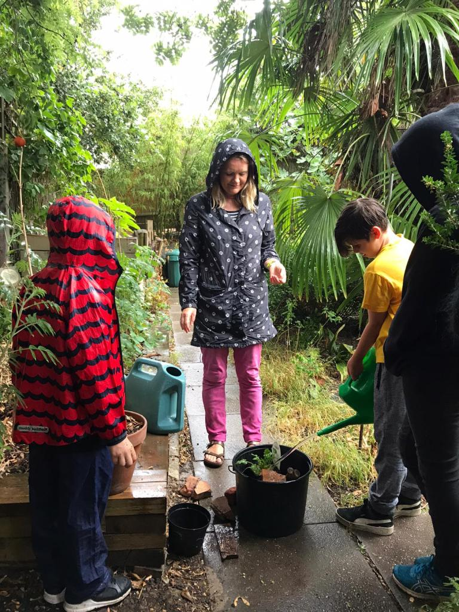
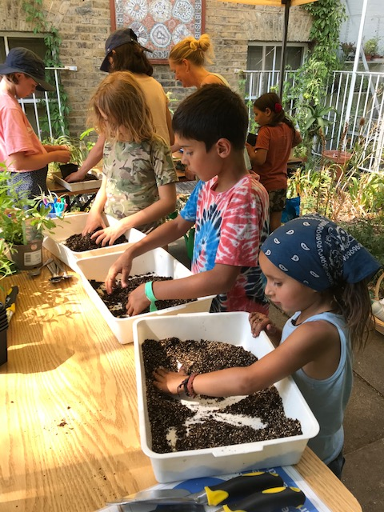
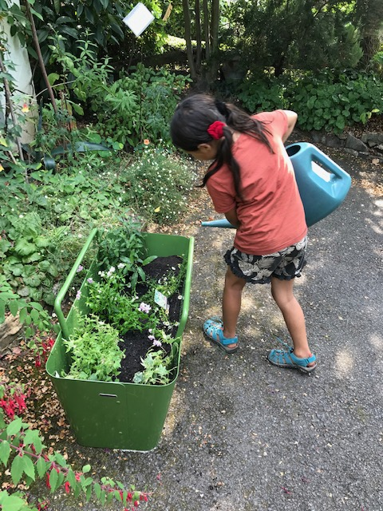
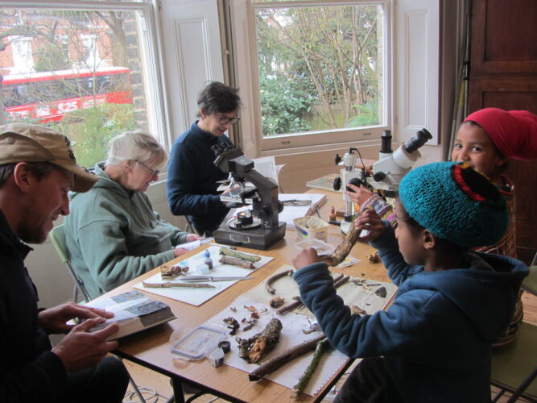
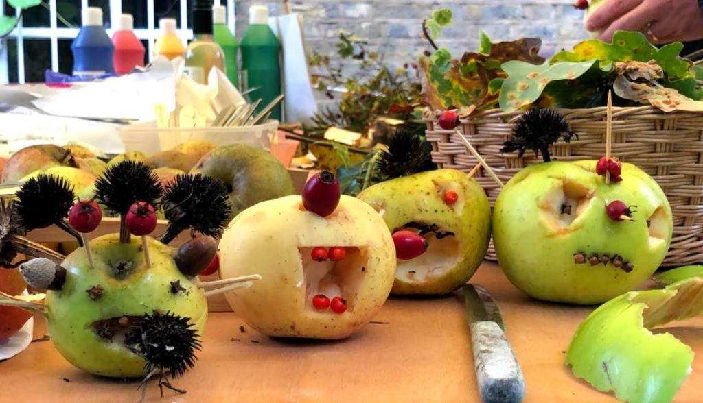
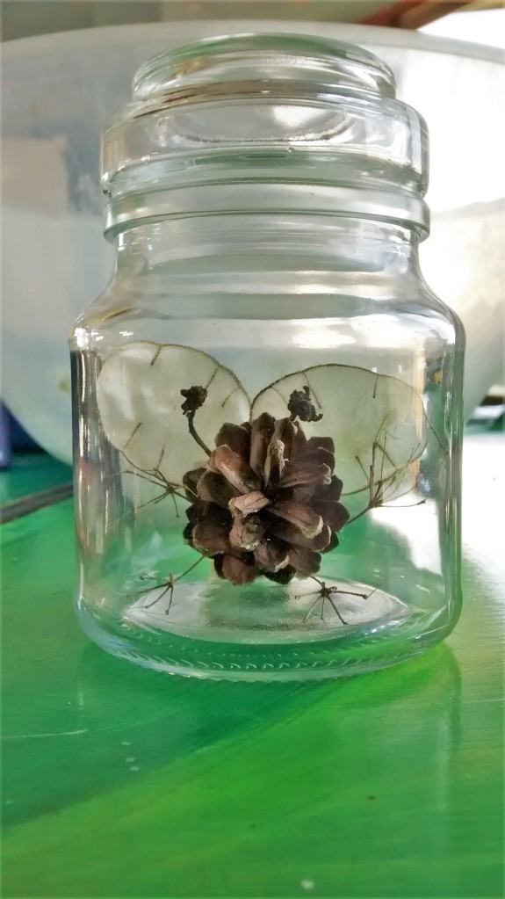
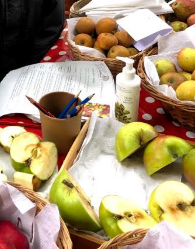

Interview with Sarah Webley, Education and Outreach Coordinator at the South
London Botanical Institute. We discuss how they structure their school
sessions, and get an overview of the huge variety of programmes they offer.

[South London Botanical Institute Website](https://www.slbi.org.uk/)

## **School sessions**

  * Classes divided into 3 groups doing different activities in a round-robin/carousel.
  * Garden and art activities led by experienced volunteers who can share their knowledge of the garden and experience as artists.
  * Groups get about 30 minutes for each activity.
  * Offers lots of variety so everyone has something to really enjoy.

### Garden activities

  * Trails around garden with challenges or questions to be completed in the garden
  * Hunts for leaves/flowers matching a description

  
  
  

### Art/Drawing activity in the library

  * Look closely at plant materials and draw them
  * Link plant material to pictures of animals and draw a food chain
  * Make a plant press
  * Create a herbarium sheet

### Microscope/science activity

  * Students can have a microscope each to use due to smaller group size.
  * Need to be patient with themselves if they can’t see the object right away.
  * Seed features and dispersal methods
  * Flowers and draw/identify parts of flowers

  

## Family event - **Apple day**

  * Tasting and comparing apple varieties 
  * Apple prints with cut apples and paint
  * Apple monsters using natural materials

  
  
  

## Guided walks and ethnobotany

  * Themes include: introduction to plant ID, autumn fungi, foraging, street weeds
  * Guide points out often overlooked diversity in the local area
  * Stories and folk-knowledge add particularly engaging element for many
  * [Flora Britannica by Richard Mabey](https://www.penguin.co.uk/books/104/1044316/flora-britannica/9781856193771.html) is an excellent UK resource

