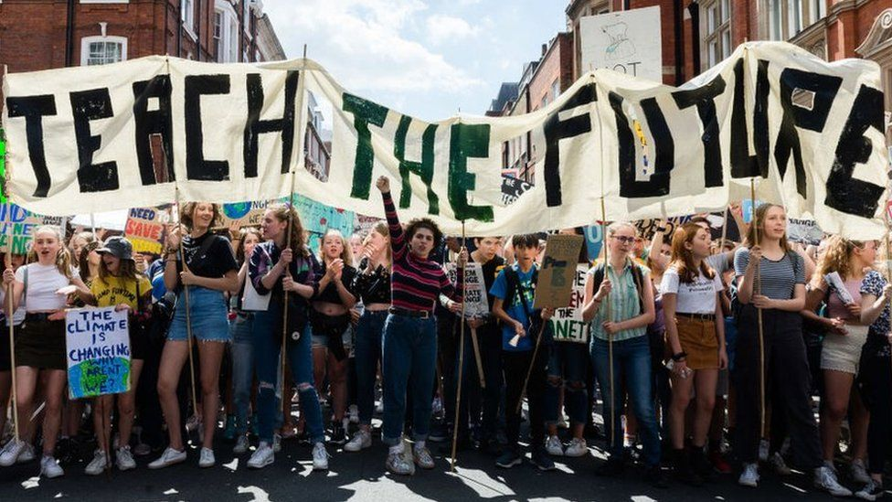



Discussion of two pieces of research and what they mean for environmental
educators. Potential problems with embedding climate and sustainability in the
curriculum. How environmental-hope-enhancing programs could resolve some of
these issues.

  * Teach the Future - State of Climate Education in the UK
    * [State of climate education in the UK report](https://www.teachthefuture.uk/teacher-research) \- Teach the future website
    * [Report results launch webinar](https://youtu.be/9tcpo9Js40k) \- YouTube

  * Journal of environmental Education
    * [Two for one: Achieving both pro-environmental behaviour and subjective well-being by implementing environmental hope enhancing programs in schools](https://www.tandfonline.com/doi/abs/10.1080/00958964.2020.1765131)

## State of Climate Education in the UK

### Top line results

  * Do you feel you've received adequate training as a teacher, during qualification or since, to educate students on climate change, its implications for the environment and societies around the world, and how these implications can be addressed?
    * 70% of teachers responded that they had not received training on any aspect of climate change.

  * When asked how climate change is taught in their school
    * 53% responded that Climate change is often mentioned, taught in the curriculum and has also been the topic of other classes or assemblies. 
    * 40% of respondents reported that climate change was rarely or never mentioned.
  * 90% felt that climate change was of concern and more should be done 
  * 90% felt climate change education should be compulsory

  * Main barriers to teaching about climate change
    * overstretched teaching the current curriculum: ~40%
    * lack of confidence in knowledge of the topic: ~20%
    * too divisive/political: 9%

### Issues raised

**Too political**

We need think about the topic into the situation and the solutions. The
situation is a physical reality. Climate systems and the impact of greenhouse
gases are now very well understood. Teachers should be able to teach about
this situation and how its impacts are felt in various subjects. The
ecological impacts are most commonly thought of, but these have human impacts
which can be studied in geography or social studies. Climate has also shaped
history.

Solutions to climate change are political. We have many tools at our disposal
to have an impact on the situation: eating less meat, reducing flights,
protection of peat bogs, renewable energy. However each of these have
different costs to different people. Weighing the costs and the benefits of
these is not an objective process, it is a political one. However teachers can
still allow students to explore these solutions and their costs/benefits.
Writing assignments or art projects can allow students to express themselves.
Teacher can assess the technical aspects of students' work without needing to
express an opinion on a student's view that everyone should be vegan, or that
all flights should be cancelled.

**Too much curriculum content already**

What is probably needed to resolve this perennial problem is a hard look at
how the education system works in the UK, and there needs to be a push to give
teachers the space and tools to teach kids how to teach themselves. Check out
these other podcasts which explore ways to rethink teaching in much more
depth.

  * BBC Radio 4 - [Positive thinking - Future Proofing our schools](https://www.bbc.co.uk/programmes/m000tcb9)
  * Cult of Pedagogy - [UDL as a key to equity](https://www.cultofpedagogy.com/udl-equity/)

**Embedding in the curriculum may not be enough and or even
counterproductive**

  * There is some evidence that longer exposure to content may be more effective at promoting pro-environmental behaviour, but evidence is mixed. 
    * Source: [Evaluating the Impact of Environmental Interpretation: A Review of Three Research Studies. Research Symposium Proceedings: Coalition for Education in the Outdoors. ](https://eric.ed.gov/?id=ED413132)

  * Too much focus big problems could lead students to suffer from empathy burnout/compassion fatigue, where students essentially tire out their ability to worry about others. Allowing teachers to be flexible in how they approach climate and other environmental issues means they would be able to adjust to the needs and interests of their class. It also allows them to give students a break, so they have time to process how they feel.

  * Adding more content to the curriculum could cause teachers to fall back on easier, but less effective teaching methods like lecturing or assigning reading. These allow teachers to cover more content quickly, but the information is often quickly forgotten.

## Environmental hope enhancing programmes

Dorit Kerret, Hod Orkibi, Shira Bukchin & Tammie Ronen (2020) Two for one: achieving both pro-environmental behavior and subjective well-being by implementing environmental-hope-enhancing programs in schools, The Journal of Environmental Education, 51:6, 434-448, DOI: [10.1080/00958964.2020.1765131](https://doi.org/10.1080/00958964.2020.1765131)

This study consisted of surveys of students in schools in Israel. Some of the
students went to normal schools, while others went to schools with green
certification, where the environment is supposed to be embedded in all
curriculum areas. The researchers found that school-type was not strongly
associated with pro-environmental behaviour. In other words, going to a green
school did not seem to have much impact on whether students took action on
environmental issues. What did have an impact was taking part in hope-
enhancing activities or programmes. Students who participated in this type of
programme were more likely to self-report that they regularly took action to
do things like reduce waste, or participate in environmental activism. They
were also more likely to report feeling positive, and have higher school
satisfaction. This result held regardless of whether the school had green
accreditation or not.

### What makes a hope enhancing programme?

**Social trust** \- Trusting that others are also doing their part. This
breaks down the feeling that there is no point doing anything because an
individual action would have no impact.

  * Programmes often involved:
    * collaboration with partners both inside and outside the school to achieve a goal. 
    * Teaching about actions which were already being taken by others
    * Building a sense of community

**Pathway thinking** \- Being able to see a path or plan a route through a
problem.

  * Programmes often involved:
    * Setting goals
    * Prioritizing
    * Tracking progress
    * Problem solving

**Agency thinking** \- Knowing what you want to do and believing that your
goal is achievable.  

### Thinking about goal setting - Approach versus Avoidance goals

An approach goal is one which you work towards achieving, an avoidance goal
focuses on preventing something from happening. As an example, an approach
goal might be to find ways of protecting or supporting biodiversity. An
avoidance goal might focus on how many species have become endangered and
preventing their extinction. The two are similar, but the researchers found
that more hopeful students tended to use ‘approach’ goals. Supporting students
in developing ‘approach goals’ may help them stay positive in their outlook.

Source: [Approach Versus Avoidance Goals: Differences in Self-Evaluation and Well-Being](https://journals.sagepub.com/doi/abs/10.1177/01461672962210009)

### Implications

**Carefully consider how environmental issues are incorporated into
sessions.**  
If an issue is only touched on at the end of a session students could leave
feeling overwhelmed and helpless. It could also trivialize the issue because
it appears not to be important enough to devote session time towards
discussing. It may be more effective to focus on a concept or the experience
of the visit. You could then provide teachers with support and resources to
build on the experience and tackle a bigger issue back in class. This approach
could allow you to focus on helping students develop a connection or
appreciation for nature. This positive experience can provide relevance and
motivation for students when they approach an issue.

**Frame environmental problems in terms of developing approach goals rather
than avoidance goals.**  
For example: Instead of 'how can we stop deforestation', which focuses on what
is being lost. You might reframe this as 'how can we help forests to grow or
thrive'. The latter includes tackling deforestation, but also includes looking
for ways to support what is good. This could help prevent kids from being
overwhelmed with negativity and eco-anxiety without losing sight of the
problem.

**Teaching students about what is being done on the site to tackle
environmental issues.**  
This supports social trust. Learning about the actions taken by a local
organization, or a local green space could be a really powerful way to
counteract feelings of helplessness. The fact that these actions are being
taken by a local organization can also bring home the message that global
issues also affect us, and that there are things which can be done to help.

**Encourage teachers to visit outdoor sites in their own time.**  
Teachers need to have positive connections with nature and are confident using
outdoor spaces, and have solid background knowledge of the topic.
Environmental organizations need to be providing hope-enhancing experiences
for teachers as well as students. Encouraging teachers to visit when you are
running hands-on activities over holidays. Allow teachers to observe and help
with school sessions. These are opportunities for teachers to take ideas and
first hand experience back to their classrooms.

