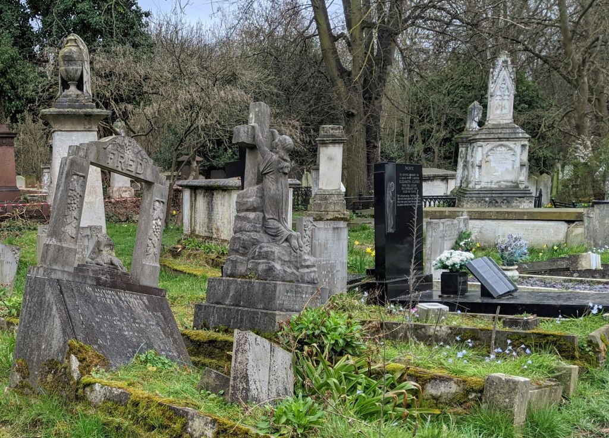
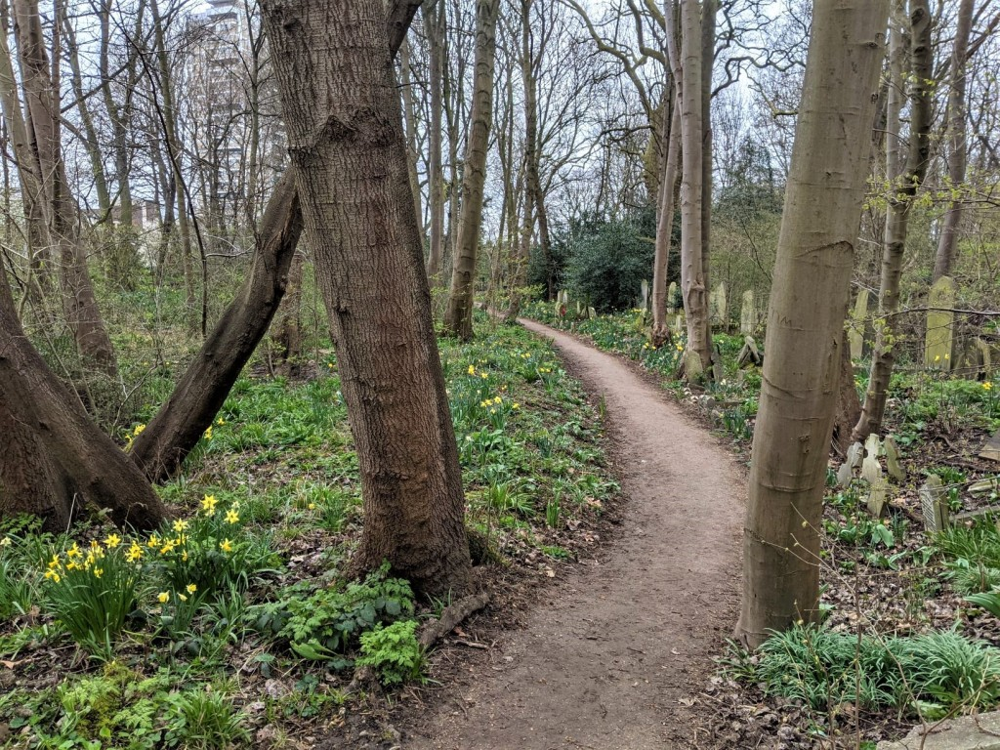
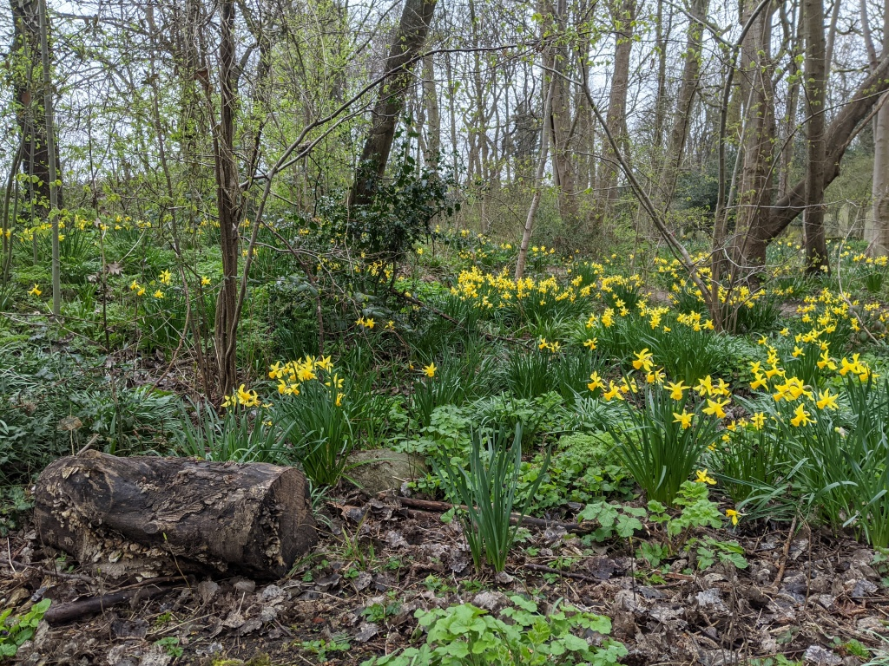



Interview with Kenneth Greenway about balancing the needs of people and nature
in a historic cemetery park.

  * Find out more about Tower Hamlet Cemetery park from [Friends of Tower Hamlets Cemetery Park](https://fothcp.org/)

  
  
  

## Managing 'anti-social behaviour'

  * Created open feeling by thinning trees and removing ivy from some trees
  * Allowed 24 hour access to the site via pedestrian gates (also stopped damage to fencing from forced entry)
  * Staff informally greet and speak with all visitors to the site so their presence is felt
  * Relationships built up with regular visitors who report anti-social behaviour or illicit commercial foragers
  * Anti-social behaviours are dealt with initially by respectful reminders that it is a public space
  * Frequent interruption b friendly chats seems to prevent anti-social behaviour because people know they will be interrupted

## Managing picking of plants and flowers

  * Borough has bylaws against picking any plants from council property
  * Tower Hamlets offers the least green space per capita of any similar area in Europe, staff respond to this situation by allowing reasonable use of the site by the community
  * Foraging for personal use is generally allowed
  * Lockdown led to a huge increase in foraging on the site and staff now request that people let them know first.
  * Children won't be yelled at for picking a flower here or there, but anyone picking bunches of flowers will be spoken to about it being a communal space so the flowers should be left for the community to enjoy.

## Foraging

  * Reconnects people into the seasons so they can plan ahead
  * Personal use value of the site for foraging is a way for people to develop appreciation for the site
  * Hopefully people eventually develop a desire to learn more about plants outside of foraging

  * Foraging walks
    * Much more take-up for foraging than general botany walks
    * Emphasise responsible foraging behaviour so that it is sustainable
    * Emphasise that foraging requires dedication to learn about the plants and how to ID them

  * Useful books
    * [Nettle Cookbook](https://books.google.co.uk/books/about/Nettle_Cookbook.html?id=afnMrQEACAAJ&redir_esc=y) \- Natural History Museum
    * [Food for Free](https://richardmabey.co.uk/food-for-free/) \- Richard Fortey

## Batwalks

  * Using the site at night seems to be a draw
  * People book online to limit numbers
  * People seem to enjoy the evening regardless of seeing any bats

  * Walk logistics
    * Begin by learning about bat ecology, break down preconceptions and myths
    * Get to see a dead bat and handle bat poo
    * Learn how to use bat detectors before setting out
    * Slowly move around the site

