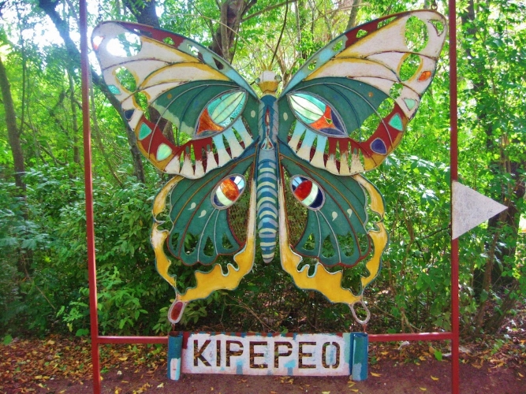



Interview with the manager of the Kipepeo Butterfly Project, a conservation
initiative manged in part by the National Museum of Kenya. The project works
with locals around the Arabuko Sokoke forest national park to breed
butterflies for export to butterfly displays around the world.

For more information check out the [Kipepeo Butterfly Project website](http://kipepeo.org/).

### Community relationships with the forest

The communities in the area had initially used the forest, which is a
protected national park, for bushmeat hunting, illegal logging, and charcoal
burning. Because it was more profitable to use land for farming, communities
had been pressuring the government to remove the protections so that the
forest could be cleared and developed.

### About the project

The project began with collection of wild butterflies for identification of
the butterflies and their food plants. Butterflies were collected from the
forest and bred in cages. Caterpillars were sent to communities to be reared.
Butterfly farmers gradually planted these host plants on their own properties
so they no longer need to collect wild plants from the forest. Once the
caterpillars have pupated, they are collected by a local representative who
records numbers and species. These are brought to 'market' days where the
pupae are counted and graded for packaging and shipping to buyers. Farmers are
paid for the species and number of pupae which successfully reach the buyers.

### Farmers have contributed to science

Close relationship between the farmers and the species they rear has improved
understanding of seasonality in butterfly species; their temperature and
humidity needs. This helps farmers improve their yields, but also informs
interpretation of patterns seen in wild populations.

Farmers are also able to identify an butterfly's sex while pupating.

### Does butterfly farming apply pressure to wild populations?

Invertebrates generally breed very rapidly and generally recover quickly from
small scale collection. Regular monitoring of wild butterfly populations have
shown no impact from the project. This regular monitoring is unlikely to have
happened without the Kipepeo Project

Today parent stock is reared at the museum's breeding facility and sent to
farmers. Collection of wild parent stock is very limited. If a farmer works
with the same species for more than 3 months, they release their captive
reared butterflies and may collect 3 females from the wild to refresh genetic
diversity.

Farmers are also licenced to enter the forest, and can report illegal
activities to the authorities. So farmers derive benefit from the forest, but
they also give back to it.

### Benefits to the community

  * 40k people are direct beneficiaries of the project (farmers and their families)
  * Protection of the forest provides ecosystem services to the community.
  * Income from the project has funded infrastructure such was water and schools. 
  * Before the project 90+% of the population was illiterate. The construction of schools has improved this, and also allowed children to be educated about the forest.
  * Butterfly farming also allows for the existence of butterfly displays internationally, and the education programs which surround them.
  * Continued support from zoos and other facilities has really helped breeders to stick with the program. Breeders feel connected and supported by other organizations involved with the butterfly industry.

