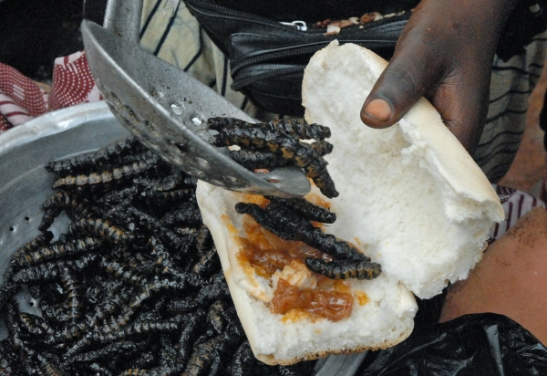
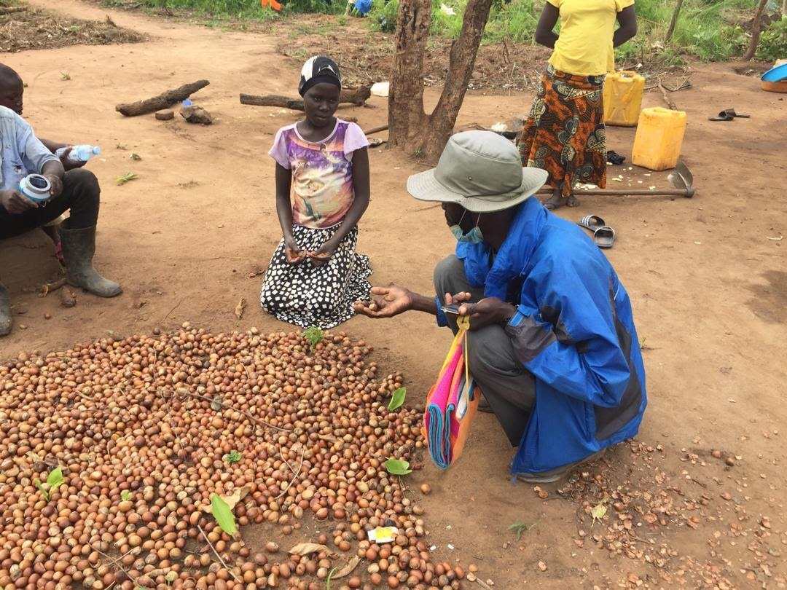



Interview with activist Mustafa Gerima about his campaign to develop local
agroforestry in order to encourage communities to protect shea trees from
being cut down for charcoal production.

[Save the Shea Tree campaign website](https://www.savethesheatree.org/).

## The value of shea trees

**Ceremony** \- Used for anointing in important ceremonies like when a new
king is enthroned.

**Cosmetics and skin care** \- Common ingredient in skin care products. Shea
oil on its own is used for skin care in West Africa for everyone from adults
to babies.

**Food** \- Shea butter is used for cooking. The pulp of the fruit is also
sweet and edible. However the fruits spoil quickly and so are not sold
commercially. The tree is also host to shea caterpillars, which are
traditionally eaten in Burkina Faso.

**Fuel** \- A large proportion of the population in West Africa depends on
trees for fuel. Rural communities often use wood, while urban populations use
charcoal. Shea wood is prised by charcoal producers because it burns longer
and and produces less smoke.

**Income** \- The dried seeds or nuts of the fruit can be stored from some
time. This allows shea butter to be produced and sold during times of the year
when other resources are more scarce.

## The problems

**Charcoal production** \- Shea wood is heavy and used as fuel and for
charcoal production. Shea charcoal is often described as longer and cleaner
burning. Farmers may sell the trees on their land to charcoal producers as it
results in large up-front sums of money which can help pay for costs like
medical bills, school fees, or loans. Shea butter does not produce as much
income annually, but trees can remain productive for more than 200 years.

An additional dimension to this problem is loose or badly written regulation
and lax enforcement of charcoal production and trade. A mix on bans on
charcoal use, production, and trade allows charcoal produced in the Shea Belt
to be exported to regions which have banned charcoal production from locally
harvested trees without address the demand for charcoal.

  * [Rush to turn ‘black diamonds’ into cash eats up Uganda’s forests, fruits ](https://news.mongabay.com/2021/06/rush-to-turn-black-diamonds-into-cash-eats-up-ugandas-forests-fruits/)\- Mongabay
  * [The charcoal grey market in Kenya, Uganda, and South Sudan](https://globalinitiative.net/analysis/charcoal-market-kenya-uganda-south-sudan/) \- Global Initiative against Transnational Organized Crime

**Changing agricultural practices** \- Shea trees are traditionally not
purposfully planted. Land in the Shea belt is traditionally used for crops for
3-10 years depending on fertility. The land would them be left fallow for up
to 15 years so the soil can recover its fertility. Saplings which grew over
this fallow period are often allowed to stand because of cultural taboos
and/or the tree's recognised usefulness.

Many traditional and staple crops which were grown with this fallowing system
have been replaced with cash crops. The pressure to have this source of income
has also led to the replacement of fallowing to replenish soil fertility with
use of artificial fertilizers. The constant use of land for agriculture does
not allow time of shea seedlings to grow.

  * [Biodiversity in West African parklands promotes pollination of shea](https://appliedecologistsblog.com/2020/06/16/biodiversity-in-west-african-parklands-promotes-pollination-of-shea/) -Applied ecologists blog

## The campaign

  1. Began with a 520 mile walk from Parliment to the deforestation site to raise awareness of the issue.
  2. Meet with women at the centre of the shea processing area
  3. Speak with cultural, spiritual, and goverment leaders.
  4. Visit all shea growing district to speak with officials.
  5. Lobby for national or international investment in shea processing equipment or facilities for local communities.
  6. Raise 7-million saplings over 10 years. Grown in a nursary until they are large enough to be planted out.
  7. Raise funds to acquire 7000 hecatres of land for shea forest regeneration.
  8. Develop the potential for shea tree tourism. Perhaps following the model of coffee tourism.

The campaign has had great success so far, garnering broad support from locals
and government officials. The campaign is now focussing on fundraising for the
growing of shea seedlings and purchasing land for restoration. Continued
lobbying is also being undertaken to ensure that the verbal support for the
campaign translates into action.

The local university is also participating. Planting shea trees on university
land which will become an outdoor lab for the university's faculties of
forestry, agriculture, and environment.

**Why is the campaign looking at sustainable use rather than legal
protection?**

Lack of resources and capacity to enforce protections on shea trees. Started
talking about the ecological aspects of the problem, but transitioned to
talking about the economic side. Developing the economic value of shea trees
and ensuring that local communities own and get the benefits from shea
processing will mean that people are incentivised to protect the trees on
their own.

> "Once the economic importance is realized the ecological benifits with come
> automatically."

**What challenges have you faced?**

There is an international charcoal trade. Some local authorities also derive
their revenue from the charcoal trade so they can feel threatened by the
campaign.

### About charcoal

https://youtu.be/xxa4cCo9CYw

### **How shea butter is made**

https://youtu.be/Q7ktkxQuCjI

### **Shea and biodiversity**

[Birds, bees and butter: Biodiversity critical for shea crop in Africa](https://www.sciencedaily.com/releases/2020/05/200526091355.htm) \- Science Daily

### **Agroforestry**

[What is Agroforestry?](https://www.soilassociation.org/causes-campaigns/agroforestry/what-is-agroforestry/) \- Soil Association

[Agroforestry benefits nature, climate and farming](https://www.woodlandtrust.org.uk/plant-trees/agroforestry-benefits/) \- Woodland Trust

[West African agroforestry parklands: keys to conservation and sustainable management](http://forest-genetic-resources-training-guide.bioversityinternational.org/fileadmin/bioversityDocs/Training/FGR_TG/additional_materials/Boffa_2000.pdf) \- Unasylva article

### Success in conservation projects

[5 reasons why many conservation efforts fail](https://news.mongabay.com/2016/03/5-reasons-why-many-conservation-efforts-fail/) \- Mongabay

[The link between healthcare and deforestation on Borneo ](https://www.bbc.co.uk/programmes/b08hnly0)\- BBC - Costing the Earth

[Key reasons why tree planting so often fails](https://www.naturebasedsolutionsinitiative.org/news/key-reasons-why-tree-planting-so-often-fails/) \- Nature Based Solutions Initiative

## Related Resources from Knowing Nature

