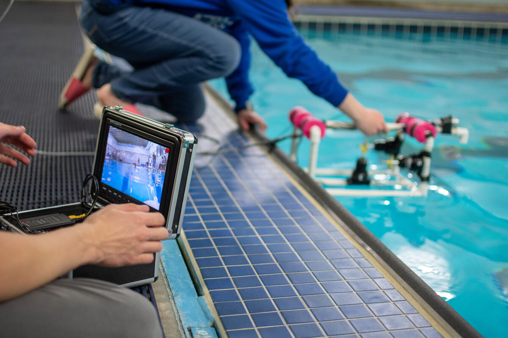
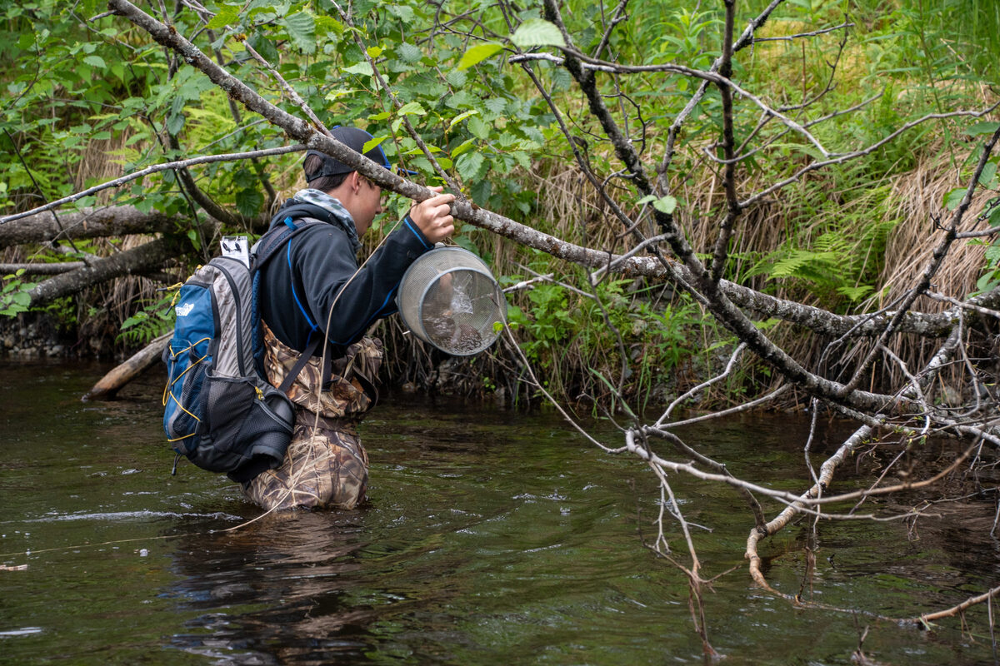



Discussion about environmental education in Cordova, Alaska. How the programs
at the Prince William Sound Science Centre address the legacy of the Exxon
Valdez oil spill. We also talk about their summer programs. Bringing together
kids from across the Copper River watershed, and allowing them to share their
different experiences with the river and understand the connections between
their communities.

[Prince William Sound Science Center Website](https://pwssc.org/)

## Cordova, Alaska and the Prince William Sound Science Centre (PWSSC)

Cordova is a city on Prince William Sound, near the mouth of the copper river
in Alaska. It is home to around 2600 people and is also one of the communities
most affected by the Exxon Valdez oil spill disaster in 1989. Then, as now,
most households in the community have at least one person involved in the
fishing industry.

The city is also now home to the Prince William Sound Science Center. A non-
profit research institution which monitors the wildlife and ecosystems of the
sound, tracks the lingering impacts of of the oil spill, and studies
sustainable use of the area’s resources. It is also an educational
institution,  which uses an innovative combination of formal and informal
educational programs to inspire life-long passion for science and raise a
society of scientifically and ecologically literate citizens who are prepared
to promote strong economies based on the sustainable use of renewable
resources.

## Community programmes

### Sea squirts

  * 1-2 hour programmes open to families with children aged 3-5
  * Structured drop-in sessions
  * Theme for the day is often introduced with a story
  * Stations around the room with instructions for simple activities and related information
  * Facilitators ask participants questions about what they are doing and noticing
  * Sessions wrap-up by sharing what happend during the session
  * If participants are leaving early, staff try to have 1-on-1 chat with before they go

Book mentioned in the episode: [What is a scientist?](https://www.goodreads.com/book/show/1979845.What_Is_a_Scientist_) \- Goodreads

For book and activity ideas, check out the [Knowing Nature's picture book pages](https://knowingnaturepodcast.wordpress.com/resources/picture-books/)

## Outreach Programmes

### Discovery Outreach programme

  * Programme timing can be flexible, from an hour to a whole day
  * Ideally participants begin with an introduction to oil spills
    * Talk about the Exxon Valdez spill and impacts if time is limited
    * Oil spill in a pan session if there is more time
      * Look at effect of oil spills on different materials
      * Tip: vegetable oil and cocoa powder is good stand-in for crude oil  

  * Participants are split into groups and introduced to the scenario
  * Tasked with building a Remotely Operated Vehicle, which can inspect oil infrastructure to prevent spills
    * ROVs must be able to move, hover, navigate obstacles, deliver an object to a target, carry a spill containment boom
    * Using a variety of matierals and sump pumps groups construct an ROV  

  * Participants try out their vehicles in any available body of water (swimming pool, docks, inflatable pools) 

[More information on the Discovery Outreach Programme](https://pwssc.org/education/discovery-outreach/) \- Prince William Sound Science Centre

**Do kids find the oil spill topic relevant?**  
The Cordova community is still seeing the impact of the spill and the event
was a major landmark in the community's history, so kids hear about it a lot
and see the relevance of the topic. More broadly, many people in Alaska are
involved in some subsistence activity like fishing, or are also spend a lot of
time out in their local environment, so they do value it and want to protect
it.  
  
Many families may have members or relatives involved in oil extraction or
fisheries industries are a very significnat part of the Alaskan economy. Kids
will also be aware of the amount of ship traffic in the waters around ther
communities, so the possibility of an oil spill is very present.

The experience of the programme also shows participants a range of job
possibilities in ROV operation, design, and engineering.

## Summer camps

### Copper River Stewardship Programme

  * Focus of the programs on stewardship of the river's recourses and how coastal activities impact the basin, and upriver activites affect downstream communities.
  * Brings together kids from across the Copper River watershed for 10 days.
  * Students from different parts of the river system (the delta and basin regions) have very different connections to the river and its resources.
  * The program brings the participants to both parts of the river, so they get to take turns being the experts.
  * Particiants also interact with scientists to learn about the ecosystems.
  * Experiencing the different environments can, on its own, be eye opening

[More about the Copper River Stewardship Programme](https://pwssc.org/education/camps/copper-river-stewardship-program/) \- Prince William Sound Science Centre

### Delta Restoration Team (DRT camp)

  * Brings together students from across the country.
  * Participants are exposed to a range of different careers including: wildlife biology, fisheries management, public recreation 
  * Take part in real work on the delta including: vegetation and habitat management, decomissioning 4-wheel trails

> "The moment of stepping back and seeing what we had done and know that it
> would make a difference, was incredible."
>
> DRT camp participant journal entry

**What benefits do you see in bringing together these groups from different
areas?**  
Bringing together people with different expereinces and backgrounds means that
we bring together different perspectives on the experience. There is a lot of
time for reflection in the programme so participants learn a great deal from
each other. The range of partner organizations also adds a lot of variety to
the experience.

  
  

## National Ocean Sciences Bowl (NOSB)

  * Academic quiz bowl competition with state-wide and national competitions
  * Teams study all aspects of marine ecology
  * Alaska Tsunami bowl has the added challenge of requiring a research paper and 15 minute presentation

[More about NOSB](https://pwssc.org/education/national-ocean-sciences-bowl/) \- Prince William Sound Science Centre  
[National Ocean Sciences Bowl](http://nosb.org/) \- NOSB.org

## Further reading on topics discussed

### Oil spills and wildlife

[How does oil impact marine life?](https://oceanservice.noaa.gov/facts/oilimpacts.html) \- National Oceanic and Atmospheric Administration  
  
[Oil spill effects and activities](https://www.operations.amsa.gov.au/kids-and-teachers-resources/kids/teachers/index.html) \- Australian Maritime Safety Authority: Kids

### Exxon Valdez Oil spill disaster

[American Scandal podcast: Exxon](https://wondery.com/shows/american-scandal/episode/5678-exxon-valdez-oil-meets-water/) \- Wondery
  
[Remembering the _Exxon Valdez_ oil spill](https://www.theatlantic.com/photo/2014/03/remembering-the-exxon-valdez-oil-spill/100703/) \- _The Atlantic_  
  
[Wounded Wilderness: The _Exxon Valdez_ Oil Spill 30 Years Later](https://www.hakaimagazine.com/news/wounded-wilderness-the-exxon-valdez-oil-spill-30-years-later/) \- _Hakai_ magazine

