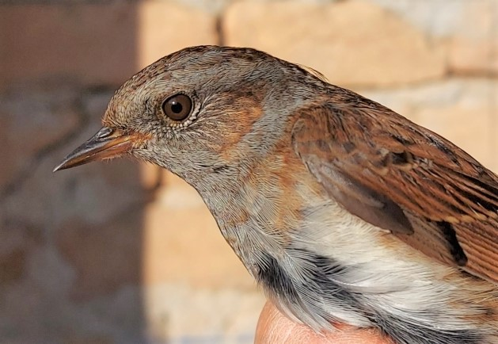



## Community science

[Tahoma Audubon Community Science](https://www.tahomaaudubon.org/community-science)

### [Backyard Bird Count](https://www.birdcount.org/)

*   Intro level activity to encourage recording sightings
*   Mid February, 4 days watch birds and report sightings
*   Sit for 15 minutes and count the birds you see or hear
*   Report sightings via Merlin app or eBird

### [Project feeder watch](https://feederwatch.org/)

*   Great for any experience level
*   Record what birds visit a feeder and number of birds seen at one time (flock size)
*   Submit results via free app or website
*   Free posters to help identify common birds at feeders
*   Accessible reports on the data collected allows you to compare different species and different regions within the United States
*   Data from previous years can be explore using fairly easy to use tools. A great resource for looking at graphin real data. [Explore Feederwatch data here.](https://feederwatch.org/explore/)

### [eBird](https://ebird.org/)

*   Platform for keeping track of bird sightings
*   Simple interface, but best suited for those with some experience with birds
*   Depth of information which can be recorded may be intimidating for beginners
*   Links with Merlin bird ID app

### [Audubon Christmas bird count](https://www.audubon.org/conservation/science/christmas-bird-count)

Developed from a tradition of going on a Christmas hunt. Concerned by potential declines in bird populations, in 1900 ornithologist Frank Chapman proposed new tradition of counting birds instead. The annual count provides a rich source of data on how bird populations are doing. Even if there isn't an Audubon society near you with an official count, anyone can do their own christmas bird count using platforms like eBird, iNaturalist, or iSpot (in the UK). 

*   December - January
*   Results from previous years is available in the Trends viewer [https://www.audubon.org/conservation/where-have-all-birds-gone](https://www.audubon.org/conservation/where-have-all-birds-gone)

### More community science projects

*   [Wetland secretive bird monitoring project](https://www.pugetsoundbirds.org/1st-project)
*   [Aging dunnocks by colour and pattern](http://blascozumeta.com/wp-content/uploads/aragon-birds/passeriformes/324.dunnock-pmodularis.pdf)

## Field trips

### [Field Trips with Tahoma Audubon](https://www.tahomaaudubon.org/fieldtrips)

*   Guided walks in the local area are suitable for everyone, welcoming to beginners
*   Planned routes, focus on birds but content can be more varied depending on walk leader and participant interest
*   Organized trips to farther locations looking for rarer birds or to see seasonal behaviour better suited to more experienced birdwatchers

### Reducing conflict between participants

*   Conflict is generally avoided by being clear about walk content and offering a range of different types to trip so potential participants can self select what they will be most comfortable with.
*   Bird hide infrastructure is much less common in the Tahoma/Washington state area. This has the effect of making birdwatching more mobile. Hides can act as points in the landscape where people congregate, potentially producing conflict between people with different ways of interacting with the environment.

## Feeding birds

Consider the potential impacts of putting out bird feeders.

*   Depending on your local environment, feeders probably play a small part in birds’ diet
*   Feeders can act as points of significant congregation, increasing chances of pathogens spreading and may attract predators
*   Feeders and spilled food can attract potential pests like rats and mice
*   Using the rural landscape to produce food for urban bird populations is likely to have impact on rural bird populations, but this is not well studied
*   The enjoyment and connection with nature provided by watching birds is valuable

Consider alternative ways of increasing foraging opportunities for birds

*   Plant trees and shrubs which are evergreen or hold berries through winter to provide natural foraging opportunities.
*   Leave dried seed heads intact
*   Leave fallen leaves where they are, providing shelter for soil invertebrates which birds can forage for through winter

## Related reading

Review of potential impacts of supplementary bird feeding on bird populations. It is likely that this action is having an impact on natural selection as it affects almost every aspect of bird ecology.  [Frontiers in Ecology and the Environment](https://www.jstor.org/stable/20440990) via JSTOR

UK garden bird feeders are associated with increases in the populations of species which use feeders. [Nature communications](https://www.nature.com/articles/s41467-019-10111-5)

Impacts of feeders on bird populations may have an impact far beyond urban environments. Increased food consumption by blue tits is associated with population increases, while other species may be being outcompeted. [Proceedings of the Royal Society](https://royalsocietypublishing.org/doi/10.1098/rspb.2021.0480)

Supplemental food is associated with overall improved health in wild birds visiting feeders. There is some increase in infectious diseases, but it is likely that this can be mitigated by regular cleaning of feeders. [Conservation Physiology](https://www.ncbi.nlm.nih.gov/pmc/articles/PMC4778448/)

Bird feeders and their impact on overwintering blackcaps in the UK and breeding success in Central Europe. [British Trust for Ornithology](https://www.bto.org/sites/default/files/u23/images/about_gbw/garden_blackcap_survey/blackcap_factsheet_low_res.pdf) factsheet

## Avian salmonellosis outbreak

[West coast avian salmonellosis outbreak (winter 2020-2021)](https://birdrescuecenter.org/salmonellosis/) - Bird Rescue Centre

[Salmonellosis Outbreak Causing Songbird Deaths](https://cdfgnews.wordpress.com/2021/02/08/salmonellosis-outbreak-causing-songbird-deaths/) - California Department of Fish and Wildlife
