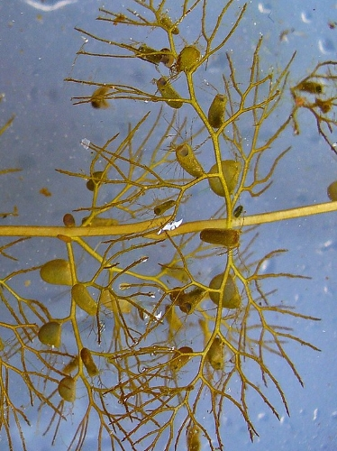

Conversation with Joshua Styles from [British Botany](https://britishbotany.co.uk/) and the [Northwest Rare Plants Initiative](http://nwrpi.weebly.com/). We talk about bogs, their importance for carbon storage, and about some of the amazing plants that live in these harsh habitats.

Josh studied Ecology at Edge Hill University and has an MSc in Biological Recording and Ecological Monitoring from Manchester Metropolitan University. In 2017 he started the Northwest Rare Plant initiative, which has helped reintroduce endangered plants into restored wetland areas around the Northwest of England. Returning plants like sundews, bladderworts, and even orchids to sites where they have declined or disappeared as changing land use degraded or destroyed habitats.

More about Josh:

- [Profile - One Tribe Talent](http://www.onetribetalent.co.uk/talent/joshua-styles/)
- [Twitter](https://twitter.com/joshual951)

## What is a raised bog?

Raised bogs in the UK mostly have their origins at the end of the last Ice Age. Glaciers left gouges or depressions in the landscape where water could collect. These conditions created low oxygen, waterlogged areas where most plants roots could not survive. However one group of plants, sphagnum mosses, survive just fine.

Sphagnum mosses have specialised porous cells which are excellent at absorbing and retaining water. Helping to maintain wet or waterlogged conditions. They also release hydrogen ions, making conditions more acidic. Lack of oxygen and acid conditions kill many of the fungi and bacteria which would otherwise cause dead plant matter to decay. This partly broken down plant matter becomes peat. This peat builds up gradually, and eventually it can actually become a raised area. Thick layers of sphagnum moss on the surface retaining moisture in the dome of peat, so the water table can be a bit higher in raised bogs than the surrounding area.

- [It's all about sphagnum](http://nwrpi.weebly.com/its-all-about-sphagnum.html) - Northwest Rare Plant Initiative

## Bogs and Climate Change

Because peat is mostly organic matter, peat soils can be up to 60% carbon compounds. Mineral soils can have very little organic matter by comparison, and even then not to any significant depth. 

In some areas, peat soils can be several metres in depth. Making bogs some of the most important terrestrial carbon storage habitats. For comparison, forest soils may have significant amounts of organic matter only for the first 30cm or so. Trees and shrubs are organic matter, made mostly of carbon. But most of the volume of forest is actually air, not wood, so the above ground storage of carbon in a forest is not as much as it at first may seem.

For those who play Minecraft, a useful comparison is the amount of dirt which can come from digging a small tunnel, compared to the amount of wood one gets from punching down several trees.

- [Measuring carbon stock in peat soils](https://apps.worldagroforestry.org/) 

- [Secrets of Soil - Woodland Conservation News - Spring 2016](https://www.woodlandtrust.org.uk/)
- [Climate change is a threat to peat bogs](https://www.imperial.ac.uk/news/138106/climate-change-poses-serious-threat-britains/) - Imperial College London

## Threats to bogs

<u>Drainage</u> - Digging ditches or drainage canals to allow ground water to more flow more freely off of an area into a waterway. This lowers the water table and allows the land to dry more quickly after rain. This can be done to increase the amount of suitable land for growing agricultural crops, tree planting, or housing and other building development.

<u>Peat harvesting</u> - Harvesting of peat for garden soil conditioner, potting compost, or fuel for heating or cooking. Peat is partly decomposed plant matter, and this builds up very slowly. Quick build-up of peat would be around 1mm per year. Removal of peat can also create the equivalent of drainage ditches, allowing water to flow out of the remaining peat and into the hollows left when peat is removed.

<u>Nutrient enrichment</u> - Adding nutrients to these habitats can allow a wider range of plants to begin to establish themselves. This is often at the expense of the specialist plants and other species which are adapted to low nutrient levels. More competition from other plants can reduce the population of sphagnum mosses which would retain water to drier weather. Drier conditions make it more difficult for sphagnum mosses to grow, and allows oxygen into the substrate and allowing bacteria and fungi to break down the plant matter and further increase available nutrients.

Nutrient enrichment or eutrophication can be caused by fertilizers applied in upland or nearby areas seeping into ground water, or blowing over onto bogs, if they are applied to fields inefficiently. Even dog walking can, over time, have an impact if owners don't clean up after their pets.

- [The bog squad](http://bogsquad.weebly.com/about-bogs.html)
- [Threats to wetlands](https://thecannproject.org/learn/threats/) - Collaborative Action for the Natural Network

## Carnivorous plants

Without decomposition to recycle nutrients, the substrate of many bogs does not have much nitrogen available to plants. Carnivorous plants have evolved many ways of coping with these conditions, including capturing and feeding on insects. Many carnivorous plant species around the world live in these low nutrient wetland habitats.

Bladderworts are an amazing group which have evolved small bladder traps which grow from their thread-like stems underwater or underground. These have small hairs near their entrance. When a small insect bushes against these hairs, the trap expands in fractions of a second. This sucks in the animal and closes a trapdoor behind them. The plant then begins to secrete enzymes into the trap to digest the animal inside.

Bladderwort traps - image by H. Zell

- [Lesser bladderwort](http://nwrpi.weebly.com/lesser-bladderwort---success-beyond-expectation.html) - Northwest Rare Plant Initiative

- [More about bladderworts - Youtube](https://www.youtube.com/watch?v=HQ69c5bRJAU)

## Plant reintroductions

An area is first selected for restoration. For bogs this might involve re-wetting the area by blocking drainage ditches or building up embankments to help retain groundwater. If the area has been nutrient enriched, plants may need to be mown and removed from the area. Reducing the amount of plant matter available to decay and be recycled, will overtime decrease the amount of available nutrients in the soil.

Seeds, cuttings, or whole plants from the surviving populations may be taken offsite for propagation. This can increase the success of new plants by providing more suitable growing conditions. The original location may be badly degraded and no longer suitable. The person cultivating the plants can also balance out unfavourable weather conditions like extreme dry spells by watering the young plants, as well as protect them from predators.

When the conditions are considered suitable for the survival of the plant species, the cultivated plants can be reintroduced to the site. These reintroduced plants are then monitored for their success and spread.

- [Northwest Rare Plants Initiative](http://nwrpi.weebly.com/)
