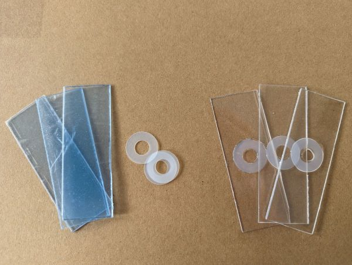

Conversation with Andy Chandler-Grevatt about moss safaris and how encounters with tiny animals can spark interest in nature and science. Andy is Senior Lecturer in Education at the University of Brighton. His research interests include science education, and teacher wellbeing, recruitment, and retention.

Andy's resources
- [Moss Safari blog](https://mosssafari.wordpress.com/)
- [Moss Safari teacher resources](https://drive.google.com/drive/folders/1q65grSQbqu0Tcrf8UoomtpM3CodEzwx4)

Follow @MossSafari on Twitter
Share your safari sightings with #MossSafariID

## What is a Moss Safari?
A simple but mesmerizing science activity. Participants wash animals from moss and then go on a microscopic safari through a drop of water. It works well for most kids and adults. With the right equipment it is easy to do and is almost guaranteed to have mesmerizing results.

## Equipment needed
Microscope with at least 40x magnification.
Cavity/well slides + Coverslips
Pipet
Funnel with cone of filter paper inside
Container to hold funnel

### Useful alternatives
Plastic cavity slides can be made by gluing a 0.5mm or thinner washer to a piece of perspex cut to the size of a slide. Make sure to use non-water soluable glue, such as superglue or epoxy. Small squares of acetate work as unbreakable coverslips.

If you don't have a dedicated microscope camera or camera-microscope adaptor, a cellphone camera held up to the eyepiece can work just as well.

## Preparing a moss squeeze
1. Take a fingernail size piece of moss and dip it in water.
2. Squeeze the water from the moss into the filter paper
3. Use the pipet to collect the last drop or two of water in the filter paper.
4. Put the concentrated moss squeeze into the cavity slide.
5. Put the coverslip on top, and touch a paper towel to the side to absorb any excess water.

## Facilitating the experience

### Start with your own names
You don't need to be able to link everything you see to their scientific names. A good starting place is to come up with your own memorable names for what you see, and start grouping similar things under those names. This builds up familiarity with the various things in your sample, how they look and behave. Then this familiarity can be used to link observed animls with scientific names.

This approach can also provide a greater sense of scientific discovery. Participants are discovering animals they have never seem before. They are describing and naming them in the same way that scientists name and describe new species. Consider extending the experience by encouraging closer observation of familiar groups to see if they really are all the same, or if different sub-types can be identified. You might start to notice additional details as you observe more of an animal. For example that some tardigrades have armour plates on their body, while others do not.

### Drawings vs photographs
It can be difficult to get photos of these tiny organisms. Particularly at higher magnifications the depth of field (depth in sharp focus), can be thinner than even these tiny organisms. This means that it can be very difficult to interpret photos of these organisms. Line drawings can make it easier to see the outline of the animals, and highlight distinctive features.

### Movement 'modes'
Moss animals often have different movement phases or modes, and can look quite different in these phases. Spending time observing one animal can reveal these different modes as the animals move around, rest, or start feeding.

### The safari model
Looking at moss samples can benefit from a little bit more structure or guidance to hold attention. This led to the development of a safari model, where there are a few specific animals to look out for as you explore. Animals which make good targets to look for should be common, easy to spot (large), and have distinctive shapes. This structure gives participants a starting framework to understand what they are seeing, and a sense of success when they see something they recognize.

## The Big 5

Here are the most common animals you'll find under the microscope.

- Mites\
  Relatives of spiders and harvestmen. These will be round bodied with 8 legs, and one of the larger things you might encounter. Around the size of a grain of sand or larger.

- Rotifers\
  These often move through the water with a leech or inchworm-like, looping, motion.  They have a sort of sucker on their more pointed 'tail' end, and two round flaps on their 'head' end. These flaps are lined with hairs which they use to whisk the water, creating a vortex that sucks particles towards their jaws or mastax. This behaviour often makes it look like they have a pair of spinning wheels on their head, which is where they get their name. 'Roti' as in 'rotate'.

- Nematodes\
  Transparent, non-segmented worms. These can vary greatly in size but are very common.

- Tardigrades\
  A highlight of any moss safari. These tiny, charismatic animals have 8 legs tipped with quite long claws. They have a snout with a round mouth at the end. At higher magnifications the shape of their mouthparts and claws are important for identifying different types of tardigrade. They move with a distinctive 'ambling' motion, reminiscent of bears.

- Gastorich\
  Flat, wormlike animals covered in cillia. They glide quickly through the water.

## Tips for success

### Choose the right moss
While you will find animals living in any moss. You might have more success with tardigrades with tuft or cusion forming mosses. This is just anecdotal, so there is an opportunity here for some experimentation to see if there really are fewer animals living in feather mosses, and more in tuft-forming mosses.

Tuft forming moss - Often found growing on walls and logs.

Feather moss - Often found growing in lawns in a flatter, spreading fashion.

### Choose the right light source
LED lighting is preferable with this activity as it is much cooler. Older incandescent lights get quite hot, and if you are using a dissection microscope, where the sample might be sitting on a plate directly above the light source, the heat can become too much for the animals after only a few minutes. If your microscope has different filters over the lightsource which polarize the light in different ways, experiment with these. You will find that different settings allow you to see different details.

### DIY darkfield lighting
Many of there small animals are nearly transparent. This can make it difficult to see them again white backgrounds. Darkfield lighting is when a slide sample is lit from the side, making the background look dark or black, making it easier to see the white outlines of transparent or translucent animals. Some microscopes have a darkfield setting built in. A similar effect can be achieved by either placing a small black dot below the sample, still allowing light in around the side. Or by lighting the sample with a torch shining in from the side.

### Let things chill out
If things are moving too quickly to see clearly or take photos, try cooling samples in a fridge for 5 or 10 minutes. THis will make everything a bit sleepy and slow without harming them.

### Choose the right magnification
20x magnificaiton works well for quickly checking how much activity you have in a sample. You can see tardigrades, mites, and nematodes at this magnification. And you will be able to identify a few other organisms based on their movement. In the slightly blurry image below, a tardigrade is circled in red. The crystals are grains of sand.

40x magnification will mean that all the Big 5 moss organisms can be seen reasonably well. Tardigrades' legs and the rotifers' feeding behaviour can be seen. But seeing the wheel-like organs on rotifers is difficult. Below is the same sample at 40x magnification.

100x will be necessary for seeing details like the mouthparts and claws of tardigrades, which are important features for identification to species level. However at this magnification faster moving organisms can be difficult to keep in your field of view. Depth of field is also much thinner, meaning it can be difficult to keep an entire organism in focus, particularly if you are using the all-plastic washer and slide setup as this gives the animals a lot of room to move about.

## Putting things back
Give everything a rinse with water. Return the moss outside, pressing gently to encourage good contact with the substrate. Pour your rinsing water over the moss to allow everything to find its way home, and hopefully help the moss to re-anchor itself to the surface.

