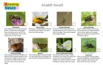
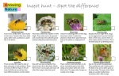
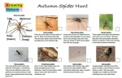
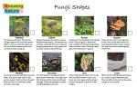

### UK invertebrates

[Early summer insects](https://knowingnaturepodcast.files.wordpress.com/2020/08/insect-hunt-2020-06-29.pdf)[Download](https://knowingnaturepodcast.files.wordpress.com/2020/08/insect-hunt-2020-06-29.pdf)

[Spot the difference (summer insects)](https://knowingnaturepodcast.files.wordpress.com/2020/08/insect-hunt-2020-07-13.pdf)[Download](https://knowingnaturepodcast.files.wordpress.com/2020/08/insect-hunt-2020-07-13.pdf)

[Autumn spider hunt](https://knowingnaturepodcast.files.wordpress.com/2021/10/2021-10-13-autumn-spider-hunt-2.pdf)[Download](https://knowingnaturepodcast.files.wordpress.com/2021/10/2021-10-13-autumn-spider-hunt-2.pdf)

### Fungi

[Fungi shapes](https://knowingnaturepodcast.files.wordpress.com/2021/11/fungi-shapes.pdf)[Download](https://knowingnaturepodcast.files.wordpress.com/2021/11/fungi-shapes.pdf)

