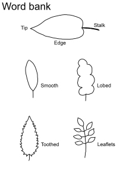
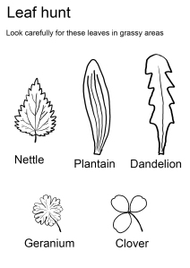

Three activities which can be used modularly, or together to create a lesson
on identifying common plants and practicing use of descriptive language. This
lends itself best to younger ages (UK KS1, age 6-7). With some work this can
also be modified to be an activity focussing on classification for older
groups.

## Sorting leaves

Sort pictures/pressed/laminated leaves into groups. Then pick one group of
leaves and describe what they have in common/why they were put in the same
group. Focus on introducing terminology for parts of a leaf and having groups
make detailed descriptions.

## Leaf hunt

Scout out your leaf hunting area to see what plants are about then build up a
scavenger hunt sheet. Go out hunting!

If you are allowing the kids to pick the leaves, reinforce that they should
carefully match as many features as possible so they only pick the leaves they
need. Most lawn ‘weeds’ are very resilient to picking. Many evolved in
grasslands where grazing and mowing are constant threats.

Another option is taking photographs of matching leaves. A small piece of
paper or card placed behind leaves provides a plain background which can help
with seeing leaf details later.

Sample leaf hunt sheets:

## 20 questions

One student closes their eyes while the rest of the class chooses a leaf. The
student opens their eyes and asks the class questions to narrow down the
options and guess the leaf. Reinforces terminology and practices using
descriptive language.

## Take it further

### Compare, contrast, and theorize

Some plants can have leaves with slightly different shapes. Kids can compare
the leaves they found and come up with theories about any differences they
spot. Remembering where they found the leaves can be useful information. This
is a good exercise to get kids thinking about how a plant’s environment
affects the way it grows. It is also an opportunity to recognize the
limitations of what they’ve learned; plant ID can require looking at flowers
and other features.

Common reasons for differences

  * They come from closely related species (ie. dandelions and their relatives, geraniums and cranesbills)
  * Lower leaves are sometimes different from ones growing higher up
  * Shaded leaves can be different from those growing in the sun, often larger.
  * Young plants/leaves can be different from mature leaves/plants

### Classification Modification

Use all the leaf images, or collect as many different leaves as you can find.
Students start making their own branching key sorting the leaves into groups,
recording the first characteristic they used. They then take the leaves in one
group and sort them again, recording the characteristics as they go.

Groups could make a diagrams of their key and compare the approaches taken.
Were there strategies which led to identifications in the fewer steps than
others?

Students could also compare their keys with those in wildflower ID guides.
What are the similarities and differences? Are there strengths or weaknesses
in the way the guides arrange their keys?

## Leaf illustrations

Feel free to download and use any of these illustrations of common lawn
wildflowers.

  
  
  
  
  
  
  
  
  

