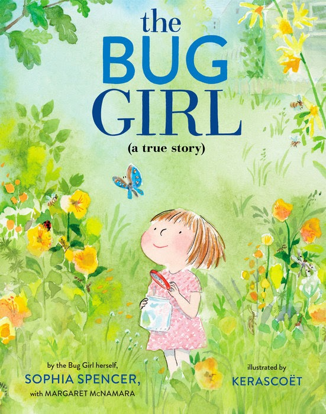

  * Author: Jackie Azúa Kramer
  * Illustrator: Magdalena Mora
  * Publisher: Roaring Brook Press
  * June 21, 2021
  * 32 Pages 
  * 4-7 years 
  * ISBN 978-1250226303 (I wish you knew)
  * ISBN 978-1250814784 (Ojalá Supieras)

## Publisher's summary

## In Environmental Education

## Discussion ideas

## Activity ideas

**Care for a classroom pet** \- Looking after a classroom pet can be a calming
activity for some kids, which also provides an opportunity to develop empathy
and responsability. Easy to care for classroom pets include fish, snails, and
giant millipedes. They all have simple regular care needs like feeding and
wiping down the walls of tanks, all of which can be undertaken by kids in a
short time. For extremely easy care, garden snails can be looked after indoors
in something as simple as a large jar with some leaves and sticks. They can
then be released back into the garden at any point.

[Giant millipede care](https://www.amentsoc.org/insects/caresheets/millipedes.html) \- Amateur Entomologists' society  
[African land snail care](https://www.amentsoc.org/insects/caresheets/giant-african-land-snails.html) \- Amateur Entomologists' society

## Further exploration of themes in the book

## More about the book

