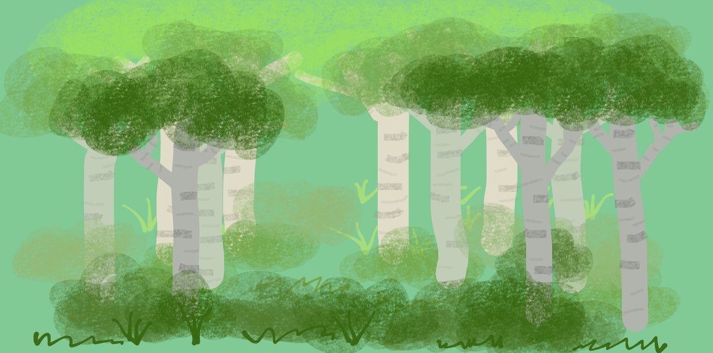
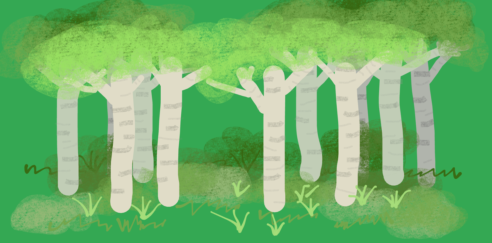



## Publisher's summary

An immigrant family embarks on their first camping trip in the Midwest in this
lively picture book by Ambreen Tariq, outdoors activist and founder of
@BrownPeopleCamping  
  
Fatima Khazi is excited for the weekend. Her family is headed to a local state
park for their first camping trip! The school week might not have gone as
planned, but outdoors, Fatima can achieve anything. She sets up a tent with
her father, builds a fire with her mother, and survives an eight-legged mutant
spider (a daddy longlegs with an impressive shadow) with her sister. At the
end of an adventurous day, the family snuggles inside one big tent, serenaded
by the sounds of the forest. The thought of leaving the magic of the outdoors
tugs at Fatima’s heart, but her sister reminds her that they can keep the
memory alive through stories–and they can always daydream about what their
next camping trip will look like.  
  
Ambreen Tariq’s picture book debut, with cheerful illustrations by Stevie
Lewis, is a rollicking family adventure, a love letter to the outdoors, and a
reminder that public land belongs to all of us.

## In Environmental Education

Surveys and visitor data from outdoor places like national parks and nature-
based visitor attractions show that these kinds of wilderness spares are
disproportionately used by white people. The lack of diversity in movies, TV,
and in stories creates a sense that outdoor activities are only for a certain
type of person. This heartwarming book tells the story of a family camping
trip, the family just happens to have moved from India to America. Telling
this story brings much-needed diversity to the image of who gets to be in
outdoor spaces, and how a camping trip can look.

The percieved deficits of being from a rural area, or a less developed
country, can become a source of shame. We see through Fatima's eyes how
different lived experiences shape a person's knowledge and skills. Many city
kids in the UK and North America learned how to build a fire on camping trips.
In this story, Fatima has never been camping but remembers helping with a wood
burning stove while visiting relatives in a rural part of India. Fatima's
father grew up in a city and was hopeless with the campfire because he'd never
needed to make one before. Fatima's memories of her life in India become more
than things which make her different from her classmates, it becomes a source
of valuable experiences.

The structure of this story contrasts Fatima's experiences at school with her
experiences camping. It highlights the impact outdoor settings and activities
can have on a child's mood and perceptions of their own abilities. Many
teachers report that students who struggle in regular classrooms respond well
to outdoor experiences. Fatima has a difficult week at school with kids making
her feel down about herself and she has trouble on a math quiz. She carries
that mood home with her but things improve as the camping trip begins. Trying
and succeding at activities very different from those in her regular classroom
gives Fatima new confidence. Back at school, she proudly talks about her new
found superpowers. We can imagine how Fatima's experience might change her
relationships with fellow students and help her overcome academic challenges.

Fatima's camping trip ends with a feeling which will be familiar to many kids
and adults: not wanting to go back home after an adventure. Without something
to transition from the experience into other contexts, having a good time can
end up accentuating difficulties in other areas and lead to disengagement. The
last thing we should want is for children to enjoy a field trip so much that
they feel the rest of school is 'boring'. We see this played out in the story.
Fatima feels sad to go home and back to school. Show and Tell is an
opportunity for Fatima to reflect on the experience and celebrate the things
she has learned, processing the experience so that it supports her personal
development.

## Discussion ideas

**Acknowledging big feelings —** The week leading up to Fatima's camping trip
is filled with big, tough feelings. There's excitement for the trip, but also
all the little things which can happen at school that drag a person down.
Share thoughts on how she might have been feeling each day. Discuss what the
trigger for her feelings might have been, and how she could have reacted.
Students might also dicuss how the kids around Fatima behaved. How could they
have known how their actions made Fatima feel? (behaviour, words, expressions
etc.) What could they do to make up for their actions?

**Sharing super powers** **—** Fatima returns to school from her first camping
trip and shares her new found super powers with her classmates. What kinds of
super powers have kids recently learned they have? What kinds of things would
they like to learn how to do? Even superheros need to learn how to control
their powers. Do the kids have skills they've learned which they want to learn
how to do better?

## Activity ideas

**Shadow monsters —** The kids in the story get scared by the shadow of a
giant monster which turns out to be a small spider. What other small creatures
or objects could turn in to scary shadow monsters? Attach small toys or cut
out paper shapes of different creatures to a skewer or thread with tape or
sticky-tac and use a flashlight or lantern to create a shadow monster puppet
show.

**Digital painting —** The illustrator of the book, Stevie Lewis, uses simple
shapes to convey the sense of a lush forest environment with many different
types of plants. Digital brushes with rough and smooth edges are used to give
sublte texture to tree trunks and grass. Taking inspiration from the
illustraions in the book, experiment with brush settings in a digital painting
program to see what effects are suited to different plants or objects. Chrome
canvas is a free web-based drawing app that works well for this. The example
images below were made in Chrome canvas.

**Foreground and Background —** The illustrator uses light colours for the
backgrounds and darker colours for the foreground. What effect does this have
on the mood of the setting? Try making a landscape with a dark background and
light foreground. Does this change the how the setting feels? If you are using
a digital painting programme, you may be able to use layers to make changing
the background easier. You can also reverse the order of the other layers so
all the darker layers are towards the back. If working on paper, postcard-
sized pictures can make this a faster activity.

**Campout cookbook —** Often food for camping is depicted as roasting
marshmallows or hotdogs on sticks. Kids could think about foods they like to
eat on a camping trip and if those would be easy dishes to cook over a
campfire. Draw or cut out pictures of the foods to make a camping menu. Older
kids could write out a recipe to add to a class camping cookbook. What special
equipment needs to be packed in order to cook a recipie while out camping?

**Plan a trip —** The parents in the story carefully planned the trip,
bringing snacks for the car and special ingredients to make breakfast the next
day. Planning is very important if you're planning to spend several days in
the woods! Young kids could practice writing lists of things they would want
to bring on a camping trip. Link this activity with the needs of living things
by having kids identify what things are essential and which are luxuries.

**Lunchtime campout —** Combine this story with ones like the Three Little
Pigs with younger groups, survival stories, or lessons about habitats. Kids
can research different types of shelters and have a go at setting them up in a
playground capsite. These might be dens using branches, rope-and-tarp
shelters, teepees made from poles and a parachute, or even just big boxes!
Alternatively, families or a local tool library might have tents to borrow.
Have lunch/snack in your campsite!

## Further exploration of themes in the book

### Race and the Great Outdoors

[Find out more about Ambreen and the @BrownPeopleCamping campain to improve diversity amongst users of public lands and the outdoors](https://www.brownpeoplecamping.com/media) \- BrownPeopleCamping.com

[Why don't black people camp?](https://www.theguardian.com/travel/2010/jul/09/black-people-camp-holidays) \- The Guardian

[Public Space, Park Space, and Racialized Space](https://www.pps.org/article/public-space-park-space-and-racialized-space) \- Project for Public Spaces 

[The BAME women making the outdoors more inclusive](https://www.theguardian.com/travel/2020/dec/02/the-bame-women-making-the-british-outdoors-more-inclusive) \- The Guardian

[As COVID-hit Brits escape to the country, minorities face rural racism](https://www.reuters.com/article/us-britain-race-rural-trfn-idUSKBN27S0LO) \- Reuters

### Things to do outside

[Ideas for things to do while camping out in a backyard or patio](https://outdoorafro.com/2020/05/ten-backyard-camping-ideas-from-outdoor-afro/) \- OutdoorAfro

### Emotional Literacy

[Social and Emotional Learning, not just for kids](https://www.cultofpedagogy.com/sel-adults/) \- Cult of Pedagogy

## More about the book

[NPR interview with Author Ambreen Tariq](https://www.npr.org/2021/03/30/982718940/camping-is-an-all-american-adventure-in-fatimas-great-outdoors) \- NPR (7 min)

[Recorded Live storytime and Q+A with the author](https://fb.watch/8EpJ7rME9b/) \- Penguin Kids publisher (hosted on Facebook; 1 hour)

[More discussion questions to go with the story](https://librarylessonswithbooks.com/fatimas-great-outdoors-picture-book-lesson-activity/) \- LibraryLessonsWithBooks.com

## Tried any activities?

If you've used this book with your class [we'd love to hear about it](/contact)! Photos,
stories, comments, or suggestions. We love them all!

