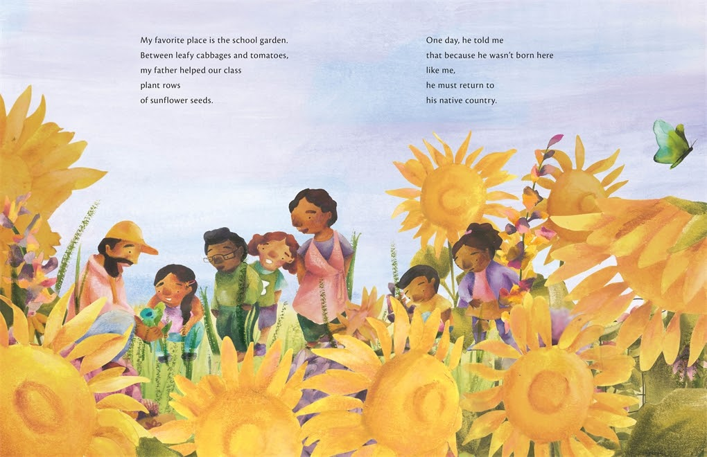
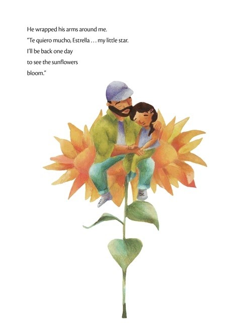

  * Author: Jackie Azúa Kramer
  * Illustrator: Magdalena Mora
  * Publisher: Roaring Brook Press
  * June 21, 2021
  * 32 Pages 
  * 4-7 years 
  * ISBN 978-1250226303 (I wish you knew)
  * ISBN 978-1250814784 (Ojalá Supieras)

## Curriculum links

  * Personal, social, health and economic education (PSHE)
  * Class community building

## Publisher's summary

When Estrella's father has to leave because _he wasn't born here, like her_,
she misses him. And she wishes people knew the way it affects her. At home. At
school.  
 _Always_.

But a school wrapped around a hundred-year-old oak tree is the perfect place
to share and listen. Some kids miss family, some kids are hungry, some kids live
in shelters. But nobody is alone.

A story about deportation, divided families, and the importance of community
in the midst of uncertainty.

## In Environmental Education

This story is about sharing and empathy. The students in the story share some
of the burdens they have been carrying, creating a classroom community which
feels safe and supportive. While the students in the story share very personal
burdens, students can of course have worries about the wider world aswell.
Climate or eco-anxiety is a feeling of fear or being overwhelmed by the
enormity of the challenge posed by climate change and other environmental
problems. Environmental education is keen to teach kids about the natural
world and the problems which humans have created. But it is easy to forget
that learning about these problems can, and perhaps should, create some
anxiety. It is important to acknowledge that the problems are scary and
worrying. It is also important to provide students with strategies for
managing those feelings so that they do not become overwhelming.

The beautiful illustrations for this story are reminders of how calming or
restorative green spaces and nature can be. Plants feature on virtually every
page. The big oak tree at the centre of the school is solid and reliable
presence throughout the book. Sunflowers brighten even the sad moment when
Estralla's father must leave the country. Nature can also provide a kind of
'soft' fascination, holding attention with movement, sound, and infinite
detail, in a way which is mentally resorative. Looking closely throughout the
book and you can see kids having fun playing in the lush school grounds and
looking at all the different creatures living there.

Early in the story, and again at the end, the class plants sunflower seeds.
The collective act reinforces the community built they've built together and
let her know that she is not alone. Planting a seed is a simple act, and it is
one of hope and patience which can teach kids many lessons. Kids learn
patience and come to understand that some things cannot be rushed. Planting
seeds can also be a 'safe' way to encounter dissapointment. Not every seed may
grow, and some seedlings may die, but planting many seeds ensures that some
will bloom.

> I wish you knew  
> That we'll be together soon.  
> Till then,  
> my friends and teacher  
> help me plant sunflower seeds,  
> and we wait  
> for them  
> to bloom.

## Discussion ideas

**Sharing circles** \- This is a way of talking through topics or
resolving problems. See the links below for more details on how to use sharing
circles.

  * [The power of sharing circles](http://www.expandedlearning360-365.com/blog/the-power-of-sharing-circles) \- expandedlearning360-365.com  

  * [Using circle practice in the classroom. Circle discussions foster community and intimacy in a classroom, and can serve academic and social and emotional purposes.](https://www.edutopia.org/article/using-circle-practice-classroom) \- Edutopia

  * [About sharing circles](https://passthefeather.ca/sharing-circles/) \- PassTheFeather.ca  

  * [A whole school approach to using circle time](https://knowingnaturepodcast.files.wordpress.com/2021/10/introducing_circle_time.pdf) \- PDF from Kent County Council

**Waiting and patience** \- Kids can share about occasions they've had to wait
for something. They might also think about things that cannot be rushed and
why. Share strategies for being patient.

## Activity ideas

**Watercolour paintings** \- The illustrations make use of a variety of
watercolour techniques. While there are many details in the pictures which
show off the artist's skill, the illustrations make use of the wonderful
'loose' quality which watercolours can have meaning the effects are very
achievable even for a kid's first try with the medium. Kids can look for how
different techniques are used to show textures. Washes for the sky. Wet in wet
for lawns and carpets. Dry brushing for blades of grass.

**Silouette picture frames** \- On the pages where students are shareing the
illustrations are framed by white silouettes which focus your attention on
each scene. Kids can consider the effect the white space has on how the
illustrations make them feel. Afterwards they can make their own illustrations
using the same technique, drawing something they would like to share on inside
the frame. Kids might also write an artists' statement about their work to
further practice expressing themselves.

**Grow sunflowers** \- Big, bright, cheerful blooms. Sunflowers are great to
grow with kids of any age, but particularly younger ones as the seeds are of a
good size to hold and plant. There are many varieties to choose from, smaller
dwarf varieties are suitable for pots or planters. If you would be growing
them in the ground, feel free to grow the giant varieties! Try growing them
with climbers like sweet peas. These are annuals, so plant them in the spring
for late summer-early autumn flowers. Don't cut the plants down when they
finish flowering, their seeds are well loved by birds and squirrels! Dried
stems can be used in spring to make bug hotels.

**Plant an outdoor sharing space** \- Allow students to choose flowers and
plants to go in outdoor planters arranged to create a space large enough for
the class to sit together in a circle for sharing. Consider presenting the
class options which will have foliage or flowers through Spring and early
Summer. To provide instant impact, at the start of the school year the class
might use plants grown from seeds they planted at the end of the previous
school year, along with bulbs which will grow up the following spring. Or the
planter might have a central small tree or shrub which will always be there,
and each year's class could plant smaller flowers around it.

## Further exploration of themes in the book

### **Supporting students**

[Teaching Students in Tough Situations](https://blog.advancementcourses.com/articles/teaching-students-tough-situations/) \- Advancement Courses

[Helping Students Cope With a Difficult Year; tips on supporting emotion regulation and building strong relationships](https://www.edutopia.org/article/helping-students-cope-difficult-year) \- Edutopia

### **Ecotherapy and benefits of exposure to nature**

[Ecotherapy – A Forgotten Ecosystem Service: A Review](https://www.ncbi.nlm.nih.gov/pmc/articles/PMC6085576/) \- Frontiers in Psychology (Academic journal article)
  
[Nature and mental health; Ideas to try in Nature](https://www.mind.org.uk/information-support/tips-for-everyday-living/nature-and-mental-health/ideas-to-try-in-nature/) \- Mind.org  
  
[The soft fascination of nature](https://www.nrpa.org/parks-recreation-magazine/2013/april/the-soft-fascination-of-nature/) \- NRPA.org

## More about the book

[About the author](https://www.jackieazuakramer.com/) \- jackieazuakramer.com

[Interview with the author and illustrator about the book](https://www.lasmusasbooks.com/blog/an-interview-with-the-author-and-illustrator-behind-i-wish-you-knew) \- Las Musas

