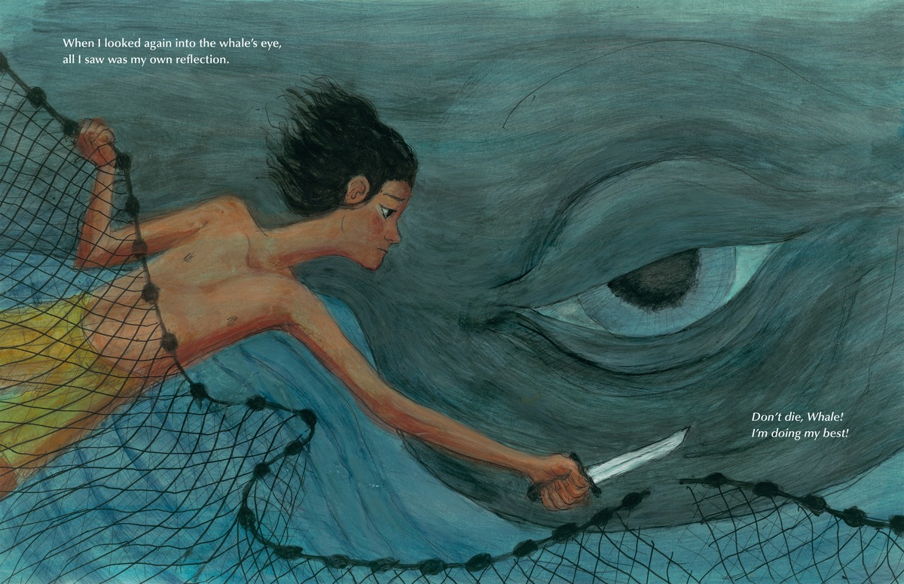
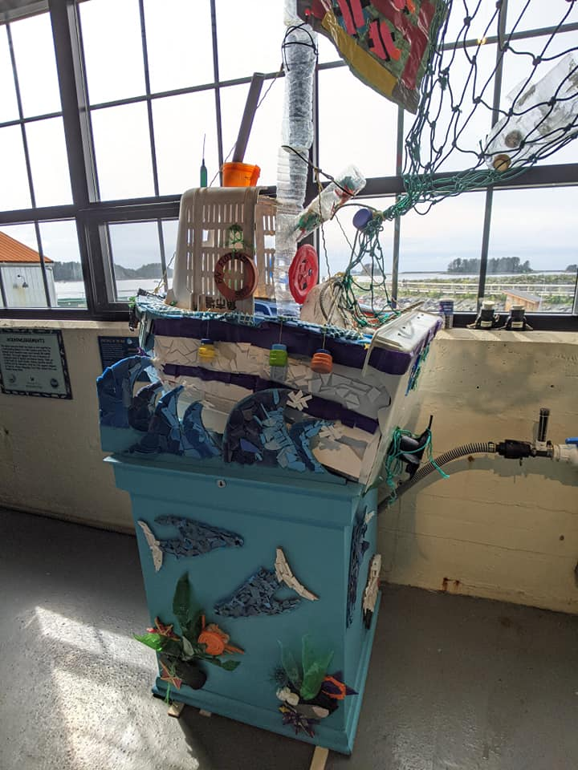



## Curriculum links

  * Science (Habitats-oceans, Needs of living things)
  * Geography (Human geography)

## Publisher's summary

A boy and his father discover a whale tangled in their only fishing net. Is
the whale dead? While the man worries about losing their net, the boy worries
about the whale. He remembers the fear he felt when, caught in a net himself
in childhood, he almost drowned before being rescued by his father. When the
whale blinks an enormous eye, the boy knows that he has to try to save the
creature, no matter how dangerous doing so may be.

Expressive and perfectly paced, this powerful story,  _The Boy and the Whale_
, by Caldecott Medal–winner Mordicai Gerstein was inspired in part by a real-
life video of a whale’s rescue, and the creature’s joyful dance through the
waves after being freed.

## In Environmental Education

A great book for thinking about human impact on oceans. When a boy sees a
whale caught in their net he worries about saving it. His father worries about
their ruined net and what it means for them. A net can be an efficient way to
catch many fish, but it can also unintentionally catch animals which fishers
do not want. These unwanted animals are called bycatch, and in this story an
unfortunate whale has become bycatch. Such a big animal has ruined their net,
and because it would be too dangerous to bring in the whale, their catch is
ruined aswell. Similar problems are faced by real fishers.

The contrast in between the fathers concern for the net and their livelihoods,
and the boy's concern for the whale is stark. A valuable reminder that
sometimes the ability to protest and be concerned about the environment is a
privileged position. We can imagine why the father's concern for how his
family will make money or get food, and his concern for his son's safety are
more important to him than the fate of the unfortunate whale. The son does not
have to worry about making money or bringing home food, so he has the freedom
to be concerned about the whale.

The scene with the boy looking into the whale's enormous eye while holding a
knife reminds me of the devastating legacy that commercial whaling had on
these ocean giants. Whales can live for over 100 years, meaning it is possible
there are still whales alive today who remember when hundreds of ships roamed
the seas hunting them and their friends. What would life have been like back
when those elder whales were young and many more of their kind swam the
oceans?

## Discussion ideas

**Different points of view** \- The father and son in the story have very
different perspectives on the situation with the whale. Kids can discuss
whether they see the father's point of view or the boy's. Why is the father
more worried about the fact that the whale has runied the net? Extend the
discussion by thinking about what the father might need in order to be more
worried about the safety of the whale.

**The whale's point of view** \- Imagine what it was like for the whale to be
tangled up. How might it have felt when the two humans came up to it? What was
it doing when it jumped out of the water at the end?

## Activity ideas

**Untangle a human knot** \- Have the group stand in a circle. Walk closer
together until everyone can reach out and hold hands with two different
people, one person in each hand. Now the group needs to work together to
untangle the human knot so everyone is back in a circle. People are only
allowed to let go of hands so arms aren't too twisted up! Keep track of how
long this takes, and imagine how long it could have taken to untangle the
whale from the net.

  * Variations:
    * Have one person stand in the middle of the group as the tangled up whale. They also act as the director, orchestrating the detangling effort.  

    * Participants can start with a strip of fabric held in one hand. Everyone needs to grab hold of someone else's fabric. This can help with anxiety about holding hands, and allows a bit more wiggle room so arms don't get too twisted up.  

    * Everyone holds their breath while untangling. You can take a breath at any time but when you do you must say "Breathe!", letting everyone know they can come up for air. Count how many breaths it takes.

**Deep sea food webs** \- Whales are thought to be an important way that
carbon gets from the ocean surface, to the deep ocean where it is sequestered
from the atmosphere. Kids can research the ecosystems that form around 'whale
falls' and the wierd and wonderful creatures in these special temporary
habitats. Make a food web to show how deep sea creatures are connected to
whales.  
[Video of a whale fall](https://youtu.be/CZzQhiNQXxU) \- EV Nautilus via YouTube  
[What happens when a whale dies?](https://www.nhm.ac.uk/discover/what-happens-when-whales-die.html) \- article from Natural History Museum London

**Design better nets** \- Bycatch is anything caught by a net other than what
the fishers want to catch. Kids can try their hand at designing better nets.
Can they design a net that catches full grown fish but lets smaller ones
through? What about nets that don't tangle up whales or dolphins? Are there
other ways of catching fish which might have less bycatch?  
[Check out this article for some ideas](https://ensia.com/features/nets-save-fish-bycatch/) \- Ensia, University of Minnesota’s Institute on the   
Environment

**Relative sizes** \- Have a look at the average size of different types of
fishing gear and different marine animals. Use a ruler and/or graph paper to
draw a picture showing different types of fishing gear and animals to scale.
You could also create sculptures roughly to scale using collected recyclables.
Looking at the completed pictures, how does the relative scale of fishing gear
and wildlife make students feel? What methods seem likely to be more
sustainable? Which methods help fishers make a living? Why do bigger fishing
nets make fish fingers to cost less?  
[Fishing gear and risks to wildlife](https://www.fisheries.noaa.gov/national/bycatch/fishing-gear-and-risks-protected-species) \- National Oceanic and Atmospheric Administration
[Commercial fishing methods](https://britishseafishing.co.uk/commercial-fishing-methods/) \- British Sea Fishing

Scuplture made from plastic littler collected from the beach. Sitka Sound Science Centre.

## Further exploration of themes in the book

### Lost fishing gear

[Challenges and misperceptions around global fishing gear loss estimates](https://www.sciencedirect.com/science/article/pii/S0308597X21001330) \- Journal of Marine Policy

### Whales

[Population status](https://iwc.int/status) \- International whaling commision
[Why do whales breach?](https://www.whalefacts.org/why-do-whales-breach/) \- WhaleFacts.org

## More about the book

[Lesson ideas and about the author](https://www.teachingbooks.net/tb.cgi?tid=58126) \- teachingbooks.net

## Tried any activities?

If you've used this book with your class we'd love to hear about it! Photos,
stories, comments, or suggestions. We love them all!

## Related resources from Knowing Nature

