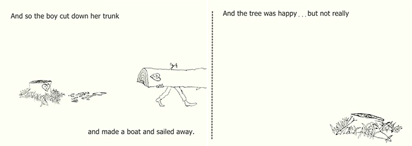

  * Author: Shel Silverstein
  * Illustrator: Shel Silverstein
  * Publisher: Particular Books
  * December 2, 2012 (First published Oct 7, 1964)
  * 64 Pages
  * 4-8 years
  * ISBN 9781846143830

## Curriculum links

  * Science (Parts of plants)
  * History (Use of wood in different time periods)
  * Trees

## Publisher's summary

_Once there was a little tree ... and she loved a little boy._  
So begins the classic bestseller, beautifully written and illustrated by the
gifted and versatile Shel Silverstein.

Every day the boy would come to the tree to eat her apples, swing from her
branches, or slide down her trunk ... and the tree was happy. But as the boy
grew older he began to want more from the tree, and the tree gave and gave and
gave.

This is a tender story, touched with sadness, aglow with consolation. Shel
Silverstein has created a moving parable for readers of all ages that offers
an affecting interpretation of the gift of giving and a serene acceptance of
another's capacity to love in return.

## In Environmental Education

The Giving Tree divides opinions. For some it is a story about unconditional
love and about charity. For others it is a sad story of a selfless tree and a
selfish boy who takes from the tree until it has nothing left to give. After
each of the boy's desires are fulfilled he goes off for a time but always
returns wanting something else. Each time the tree gives what it can and hopes
the boy will be happy, but it is left to us to imagine wether or not the
fulfillment of each desire actually does make him happy. For environmental
education, the story becomes powerful when different views come together,
sparking discussion and reflection on human relationships with nature.

The book is a great reminder of how much humans depend upon plants. The boy
gets food, shelter, recreation, income, and even transportation from the apple
tree. It can also be read as a cautionary tale against endless human
consumption. Trees can be a renewable resource, given enough time. But the
tree is not used sustainably here. The boy takes everything the tree has to
give, leaving nothing for the tree, and nothing for the future. Until, in the
end, the remaining stump has nothing left to offer. A very melancholic ending.
If the boy had a child of his own, what would their life be like? No big apple
tree to climb up, play in, or sleep beneath.

The boy's relationship with nature is purely extractive and focused on the
short term. People do need to extract things from nature. But people can also
give back to and support nature. We can stweard the resources for future
generations. We can imagine how events might have ended differently if the boy
had thought a bit more about the future. How different would the final page
look ig he had planted seeds from the apples he ate when he was young? How
much of the tree would remain by the end of thestory if the boy had taken only
a few branches at a time, allowing time for new ones to grow in their place?

## Discussion ideas

**How do you feel about the boy and the tree?** \- Often very productive
discussions can begin simply by voicing reactions to the story. Listening to
the way others interpreted this very simple narrative often generates many
discussions about whether this is a nice story or not. Whether the tree was
kind and generous, or being taken advantage of. It can be important here to
keep the discussion on reflection on the story, and not judgement of other
people's reactions.

**Boundaries and relationships** \- The story begins with the tree and the boy
having fun and playing together. As the boy grows up his relationship with the
tree changes. Kids can begin by considering how the tree might have felt when
the boy came to play, and compare that with the boy coming to it wanting
something. Is it okay that the relationship changes as the boy grow up? Is the
relationship between the boy and the tree always nice? Equal? Is there
anything the boy could have done differently to make the relationship a nicer
one?

**Saying 'No'** \- The apple tree always helps the boy in the story, even when
doing so hurts the tree. Kids can think about how the tree have felt giving up
its apples. Is this the same, or different from when the tree gave up its
branches? Or its whole trunk? What is different about being asked to give up
these things, or are they all the same? When might it have been okay for the
tree to say 'No, I can't help you.' or at least 'I can only help you this
much.'?

## Activity ideas

**Apple taste test** \- There are hundreds of different apple varieties in the
world, but only a handful in grocery stores. Explore different flavours and
textures by trying a few different varieties side-by-side and make tasting
notes. Take the activity farther by speaking with a farmer about the varieties
they grow and why. Extend the activity even more by researching how apple
varieties are developed and why we only have a few in shops when there have
been so many different varieties. What are the pros and cons of the varieties
we find in stores today?

  * [Gallery of apple varieties](https://www.applesfromny.com/varieties/) \- Apples from NY
  * [A Curious Tale: The Apple in North America](https://www.bbg.org/gardening/article/the_apple_in_north_america) \- Brooklyn Botanic Garden  

**Willow/Hazel weaving** \- Unlike the apple tree in the story, many trees
continue to grow new branches throughout their lives. Some, like willows and
hazel, can regrow even if the entire trunk is cut down. These will often sent
up suckers from the stump or roots, which grow into long canes which can be
harvested every few years. Try your hand a simple willow weaving projects. If
you have access to enough material, you might even weave your own willow
baskets, or even weave fences for flower beds.

  * [Willow fish ](https://youtu.be/qVlFrBLICrA)\- Big Green Art via YouTube
  * [How I Braided a Willow Fence For The Garden](https://youtu.be/cZDwnu6QyWA) \- The Farm Dream via YouTube  

**What plants give people** \- The boy in the story goes to the apple tree for
all of his needs. Kids may already know that plants produce oxygen, they can
research other materials and everyday objects which are made from plants.
Which materials come from fast or slow growing plants? Do these materials come
from fast or slow growing plants? What materials do we get from plants in a
sustainable way? What materials are less sustainable?  
  
 **Harvesting from trees** \- An extension of the activity above. Research
different ways of harvesting materials from trees. Cinnamon and cork are both
tree bark which is harvested from the tree without killing it. After a few
years the material regrows and can be harvested again. Kids might also learn
about pruning, coppicing, and pollarding, all ways of taking branches off
trees without killing them as a way of harvesting resources and managing the
growth of the tree.

**"Fix" the story** \- Once kids have had a chance to reflect and discuss the
story, most will agree at least that the story is a little bit of a sad one.
Use discussion to generate ideas about different ways the story can be made
happier or how the relationship between the boy and the tree could be made
more equal. Kids can then rewrite the story. The simple illustrations mean
that the pages can be photocopied or scanned and edited with the new and
improved story.

  * [The tree who set healthy boundaries a parody alternate ending](https://www.topherpayne.com/giving-tree) \- Topher Payne

## More about the book

[We Need to Talk About ‘The Giving Tree’; Kids and parents need to understand that there’s a big difference between selflessness and generosity. ](https://www.nytimes.com/2020/04/15/parenting/we-need-to-talk-about-the-giving-tree.html)\- New York Times  
[  
“The Giving Tree” at Fifty: Sadder Than I Remembered (reflecting on the book
and author)](https://www.newyorker.com/books/page-turner/giving-
tree-50-sadder-remembered) \- The New Yorker

[About the author](https://www.shelsilverstein.com/about-shel/) \- ShelSilverstein.com

## Further exploration of themes in the book

### Developing empathy

[4 Strategies for teaching empathy](https://www.edutopia.org/article/4-proven-strategies-teaching-empathy-donna-wilson-marcus-conyers) \- Edutopia  
[  
Teaching kids about boundaries](https://childmind.org/article/teaching-kids-
boundaries-empathy/) \- Child Mind Institute  
  
[Six Habits of Highly Empathic People](https://greatergood.berkeley.edu/article/item/six_habits_of_highly_empathic_people1) \- Greater Good Magazine

### Sustainable wood use

[What is coppicing?](https://youtu.be/FkRuMqVuJDE) -Forestry Commision via YouTube

## Tried any activities?

If you've used this book with your class we'd love to hear about it! Photos,
stories, comments, or suggestions. We love them all!
