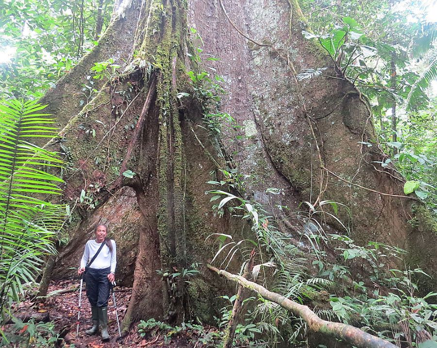



## Curriculum links

  * Habitats
  * Needs of living things
  * Classification

## Publisher's summary

In the dense, green Amazon rain forest, a man has come to chop down a great
Kapok tree. When he lies down to rest, the creatures that inhabit the tree and
the surrounding forest come to whisper in his ear, each in its own fashion
begging him to spare their home. "You see, all living things depend on one
another," buzzes the bee. A boa constrictor, monkeys, colorful birds, a small
tree frog, a jaguar, tree porcupines, anteaters, and a three-toed sloth take
their turns, each giving an additional reason for the man to abandon his
mission and choose to preserve this unique environment. Finally, a young child
of the Yanomamo tribe whispers, "Senior, when you awake, please look upon us
all with new eyes." And that is exactly what the man does.

Award-winning author/illustrator Cherry visited Brazil's Amazon rain forest to
research her illustrations for this moving environmental fable. Her lush,
colored-pencil and watercolor pictures convey the magic and magnificence of
the complex ecosystem, with plant and animal life of every form filling the
pages elegantly and abundantly: Her thoughtful text conveys the surprising
fragility of this awesome environment. Gorgeous endpapers include a map and
labeled illustrations of a range of Amazon wildlife. When  _The Great Kapok
Tree_  first came out, it was at the forefront of the ecological movement to
save the rain forests: Today's young readers will feel its heartfelt message
just as strongly.

## In Environmental Education

Giving the reader a taste of how many species can depend on a single tree,
this is a phenomenal book for introducing habitats and the Amazon rainforest.
The book also features a map of where tropical rainforests can be found, and
compares their original and their current extent. Richly detailed
illustrations convey the biodiversity and abundance of rainforests and can are
detailed enough that they could be used to intoduction to classification.

The book begins with a man walking into the forest and starting to chop down a
tree. It ends with the man walking out of the forest and leaving his axe
behind. The simple message is that the man has learned about how important the
tree is and this convinced him to stop cutting it down. Would this kind of
experience be enough to prevent deforestation? It seems unlikely that
awareness of the ecological value of rainforests would be enough. In areas of
subsistence farming, communities are very aware of the value of what the
forest provides. However these communities can still be driven to illegal
logging by a sudden need for extra money, for example if there is an accident
requiring medical treatment.

Actions to protect rainforests need to be based on listening to local
communities and participants in the industries involved. The driving foreces
behind deforestation need to be determined so that they can be addressed. Real
value can be added to this story by an educator simply asking the reader: What
brought the man into the forest? And what are the consequences of leaving?
Without other ways of making a living it can be difficult for the people
involved to support efforts at stop resource extraction. Just restricting
access to the land and its recources can lead to resentment from local
communities, making enforcement more difficult.

Person standing next to the roots and trunk of a kapok tree. Photo by Dick Culbert from wikimedia commons.

## Discussion ideas

**Before and After** \- Kids imagine and share what they think might have
happened before and after the story. What brought the man into the rainforest?
What happened to him after he left?

**How much is beauty worth?** \- The sloth in the story asks the man this
question. Kids could discuss their ideas about this question. How much is
natural beauty worth? Could we live without it? This question could also be
approached from a different angle, how much natural beauty is it okay to lose?
People need wood to build houses and cook food, how many trees can be cut down
before it is too many trees?

## Activity ideas

**The Great (insert local tree here) Tree** \- Spend some time looking at a
favourite local tree. Record what animals visit the tree and what they do
there. Kids might use binoculars to watch birds, or magnifying glasses to look
for insects on the bark. Climb up a branch or use a ladder to inspect the
canopy. Put a sheet or umbrella under a branch and give it a good shake to see
who falls out. Scoop leaf litter or soil frome around the base of the tree
into a tray and look for critters. Kids could then write a story about their
own Great Local Tree following the narrative patterns in the book.

**Illustrate your own story** \- Using the results of the exploration above,
kids could draw or paint pictures of the different animals and plants they
found living around their tree. Create zoomed in pictures which focus on
different parts of the tree. The canopy, branches, trunk, ground, and
underground.

**Alternate ending/Sequal** \- Imagining the man did cut fown the kapok tree,
kids could research and write a story about what might have happened next.
They might describe what happened to the food chains which depended on the
tree. Kids could research what happens when a tree naturally dies in the
rainforest. What would be the similarities and differences between a tree
dying and rotting versus being cut down and removed?

**Biodiversity survey** \- This book is filled with rich, lush illustrations
featuring many rainforest species. Revisit each page and count how many
different types of animals and plants kids can spot. Kids could keep a tally
of different animal groups (insects, mammals, etc).

**Sustainable forestry plan** \- Kids research uses for the trees in the
forests near them or how forests in their area have historically been used. In
North America this might be learning about maple syrup, or the uses of birch
bark. In Europe there is the history of coppicing or fattening up pigs on
acorns. How do people use the forests now? Kids could then imagine a their own
forest and draw a plan for how it might be used by people and wildlife.

**Identify rainforest products** \- Go on a hunt through kitchen cupboards or
shop shelves and look for foods or spices which come from rainforests. Kids
might reseach a few of the things in their cupboards and find out what part of
a rainforest those foods come from. For instance coffee is a rainforest
understory tree, vanilla grows high up in trees, and cinamon is the bark of
tall trees.

## Further exploration of themes in the book

### Economics of deforestation

[Amazon deforestation leads to economic boom and bust](https://www.newscientist.com/article/dn17298-amazon-deforestation-leads-to-economic-boom-and-bust/) \- New Scientist

[Why is palm oil so cheap?](https://youtu.be/vvKgnRPThKI) \- Bussiness Insider via Youtube

### Fighting raindorest deforestation

[Amazonia Undercover: unexpected allies against deforestation. Discussion about the documentary.](https://globalcanopy.org/insights/insight/amazonia-undercover-unexpected-allies-against-deforestation/) \- GlobalCanopy.org  
  
[The link between healthcare and deforestation on Borneo](https://www.bbc.co.uk/programmes/b08hnly0) \- BBC - Costing the Earth

### More in the importance of rainforests

[Study suggests droughts weaken the Amazon’s capacity to bounce back](https://news.mongabay.com/2021/12/barrage-of-droughts-weakens-amazons-capacity-to-bounce-back-study-finds/) \- Mongabay

## More about the book

[Activity ideas for different curriculum area](https://www.teachingideas.co.uk/library/books/the-great-kapok-tree)[s](https://www.teachingideas.co.uk/library/books/the-great-kapok-tree) \- TeachingIdeas.co.uk

[Creator Interview: Lynne Cherry](http://www.judynewmanatscholastic.com/blog/2020/04/interview-lynne-cherry-great-kapok-tree/) \- Judy Newman at Scholastic

