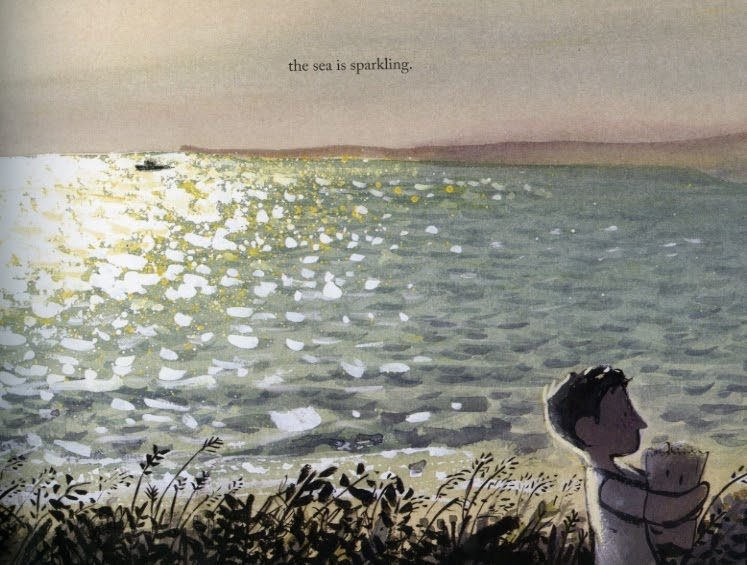



## Curriculum links

  * History
  * Personal, social, health and economic education ( PSHE )

## Publisher's summary

A young boy wakes up to the sound of the sea, visits his grandfather's grave
after lunch and comes home to a simple family dinner, but all the while his
mind strays to his father digging for coal deep down under the sea. Stunning
illustrations by Sydney Smith, the award-winning illustrator of  _Sidewalk
Flowers_ , show the striking contrast between a sparkling seaside day and the
darkness underground where the miners dig.

With curriculum connections to communities and the history of mining, this
beautifully understated and haunting story brings a piece of history to life.
The ever-present ocean and inevitable pattern of life in a maritime mining
town will enthrall children and move adult readers.

## In Environmental Education

Transitioning away from fossil fuels is necessary. This book can be used as an
entrypoint to thinking about the impacts this transition will have on
communities which depend on mining. In this story we can imagine the impact on
the shops in town if people no longer had work from the mines. There is also
the impact on the boy's future. At the end of the book he knows what he will
do when he grows up. He will work down in the tunnels because "that's how it
goes". Living in a community where jobs tend to be passed down, it's not clear
that the boy feels this is a limitation. How might he feel if that future
prospect was removed and not replaced?

> I think about the bright days of summer and the dark tunnels underground.
> One day, it will be my turn. I am a miner's son. In my town, that's the way
> it goes.
>
> -Town is by the Sea

Throughout the story the sea is a bight and calm presence which lends the
story a nostalgic, hazy, summer day quality. Yet the narrative and
illustrations put tension between the bright surface waves and the father
digging under the sea in dark tunnels. Thinking about this tension leads the
reader to thinking about that parts of life in this town which we aren't told
about. The presence of the mine brings many economic positives to the
community, but many negatives as well. Not the least of which is the worry for
the miners underground.

In the book we are told about a sunny summer day. The sea in the book is calm
but in reality it can also be powerful and violent. This other side of the sea
will become more pronounced as oceans warm and storms become more intense. As
readers we are left to imagine what life in this community would be like if we
do not transition away from fossil fuels. The boy would grow up and take his
turn in the tunnels, like his father and grandfather, but how will a day in
his son's life go?

## Discussion ideas

**Feelings** \- This is a beautiful book for exploring more subtle emotions.
There are few facial expressions as clues, and, instead the reader needs to
rely on body language, and the connection between the words and the
illustrations. Discuss how the boy might be feeling at different moments in
the book. When he looks at the sea, plays on the swings, waits for his father
to come home.

**Some things change. Some things stay the same.** \- Kids can reflect on day-
to-day routines which don't change. They might also think about times a
routine changed. How do they feel about their routine? How did they feel when
a routine changed? Kids could reflect on patterns in their life they wish they
could change and think of how they might be able to make that change happen.

**Following in footsteps** \- [In one estimate](https://www.ft.com/content/db105e7e-ce4a-11e5-831d-09f7778e7377) (Financial Times, Feb 25, 2016), during Victorian times around 50% of children ended up in the same job as their mother or father, today it is less than 10%. In the story children following in their parent's footsteps is the way things go. How does this make kids feel? Do they want to follow in their parent's footsteps? What steps do kids need to do in order to achieve their goal? 

## Activity ideas

### History: Visit a mine or factory
As the industrial revolution recedes farther
into the past, there are many communities where former mines and manufacturing
facilities have reopened as heritage sites. Often these places are important
to the area's transition into a different economy. These sites are also often
staffed by local people with strong connections to that industrial heritage.
Simply visitng and speaking with the staff and volunteers is wonderful way to
honor that heritage and support their community.

### Art: Paint the sea
The sea is a recurring theme throughout the book, and
the paintings of it are beautifuly calming. Watch videos of ocean waves as a
calming transition from other activities and to observe the shapes and
patterns waves make. Create a seascape using one of more painting techniques.  
\- [Watercolour tutorial // How to Paint Waves](https://youtu.be/J-LDUK-XhRM) \- Youtube  
\- [Paint beautiful gouache waves](https://youtu.be/ewZQdYUMZpA) \- Youtube (techniques work with poster/tempera paint)
\- [Acrylic Painting Tutorial - How To Paint Waves](https://youtu.be/lfNHdQQDiuY) \- Youtube (techniques work with poster/tempera paint)

### Art: Emotions in figures
Look at how the illustrator uses subtle cues to
tell the redear how the characters are feeling. Try drawing simple stick
figures in different poses that show different emotions. How does changing the
position of the head change how it feels? Adding a line for a mouth, how do
changes in the shape of the line change how it feels?

### Geography: Where do materials come from?
Kids research materials which come from
the ground and how they are extracted. What everyday objects use materials
which come from mining? What are the environmental consequences of different
type of mining? Taking this project further, kids could consider what life
would be like humans reduced or stopped mining.

### History: What happens when a mine closes?
There are many communities around the
world which formed because of, and continue to depend upon, mining. Kids could
research what has happened to mining towns when the mines closed, and think
about how people's lives might have changed. What are the consequences for
smaller bussinesses if a big part of the community loses their jobs? What
might affect how easy or difficult it might be for people to get other jobs?
How could communities be supported to make the transition easier?

  * [How Ex-Miners Turn Toxic Land into Lavender Farms](https://youtu.be/3rCxAdRo-h4) \- Business Insider via YouTube
  * [Coal communities in transition: A case study of Colstrip, Montana](https://media.rff.org/documents/RFF_Report_21-01_Colstrip_Case_Study.pdf) \- Resources for the Future; Envirionmental defense fund

## More about the book

[Book review](https://justimagine.co.uk/review/town-is-by-the-sea/) \- Just imagine

[Language arts unit on Town is by the Sea](https://knowingnaturepodcast.files.wordpress.com/2021/11/town_is_by_the_sea_book_topic.pdf) \- Teachwire.net

[More activities and discussion ideas](https://www.castofthousands.co.uk/book/town-is-by-the-sea) \- Cast of Thousands

## Further exploration of themes in the book

### Career aspirations

[The jobs you're most likely to inherit from your mother and father](https://www.nytimes.com/interactive/2017/11/22/upshot/the-jobs-youre-most-likely-to-inherit-from-your-mother-and-father.html) \- The New York Times  
  
[Supporting students' career and educational aspirations](https://www.teachermagazine.com/au_en/articles/supporting-students-career-and-educational-aspirations) \- Teacher Magazine  
  
[A framework for student goal setting](https://www.edutopia.org/article/framework-student-goal-setting) \- Edutopia

### Transitioning away from mining

[Appalachia is transitioning from coal. Here’s what it could learn from Germany.](https://us.boell.org/en/2019/11/01/appalachia-transitioning-coal-heres-what-it-could-learn-germany) \- Heinrich Boell Foundation  
  
[This Kentucky coal town is fighting for survival long after the war on coal is over](https://www.cnbc.com/2018/03/29/the-kentucky-coal-town-fighting-to-survive-after-coal-mining-closings.html) \- CNBC

